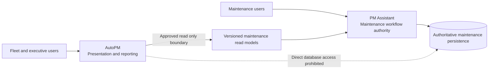

# FleetOS Product Specification v1.0

## Document control

- Version: 1.0
- Status: Product specification baseline for Product Owner review
- Product: FleetOS — Fleet Operating System
- Modules: AutoPM and PM Assistant
- Decision owner: FleetOS Product Owner

This specification defines the intended FleetOS v1.0 product. It does not authorize source changes, data migration, deployment, credentials, external-service changes, or release. Target capabilities become operational only after their blocking decisions are approved, implementation is completed, validation evidence passes, and the Product Owner separately approves release.

## Product vision

FleetOS connects fleet visibility with controlled preventive-maintenance execution while preserving two distinct products:

- **AutoPM** turns approved fleet and maintenance information into dashboards, KPIs, calendars, filters, reports, and executive views.
- **PM Assistant** controls maintenance planning, workflow, completion, history, notifications, scheduling, imports, synchronization audit, and authoritative maintenance persistence.

FleetOS v1.0 replaces accidental coupling and ambiguous status sharing with explicit product ownership, a versioned read boundary, visible data freshness, traceable data movement, and reversible delivery.

## Business problem

Current repository evidence shows separate information paths. AutoPM consumes Google Sheets through Apps Script or CSV, calculates mileage-oriented dashboard status in browser code, and may use browser cache or `data.csv`. PM Assistant persists maintenance workflow information locally and provides planning, completion, history, notification, scheduler, import, and weekly-control behavior through current unversioned routes.

Without a governed product boundary:

- fleet visibility can differ from authoritative maintenance workflow state;
- mileage condition can be confused with workflow, completion, or notification state;
- vehicle and location text can be matched incorrectly;
- stale presentation data can appear current;
- duplicated business rules can drift;
- direct database coupling could compromise independent deployment and rollback;
- imports, schedules, notifications, and corrections can lack consistent traceability;
- proposed infrastructure can be mistaken for an operational product capability.

FleetOS v1.0 addresses these risks without merging AutoPM and PM Assistant or assigning authority to a transitional source.

## Product objectives

1. Preserve AutoPM and PM Assistant as separate bounded modules and rollback units.
2. Establish one authoritative maintenance workflow boundary in PM Assistant.
3. Keep AutoPM read-only for maintenance workflow information.
4. Provide approved maintenance information through a versioned read interface or approved read model.
5. Preserve separate mileage, workflow, completion, and notification meanings.
6. Make source, freshness, stale state, ambiguity, conflict, and unavailability visible.
7. Reconcile transitional identities without guessing or destructive merging.
8. Make plan, completion, history, import, scheduler, notification, and audit behavior testable and traceable.
9. Require security, reliability, recovery, observability, and user-acceptance evidence before production release.
10. Support staged cutover and component-specific rollback without transferring maintenance authority.

## Product principles

- Domain ownership outranks timestamps.
- Presentation state never becomes maintenance workflow authority.
- A database-engine or hosting change does not change product ownership.
- Valid empty data, missing data, stale data, conflicting data, and unavailable authoritative data are different outcomes.
- Current source behavior is evidence, not an automatic v1 contract.
- Product requirements remain vendor-neutral unless the Product Owner approves a specific dependency.
- No unresolved safety-critical decision is concealed behind confident implementation language.

## Target users

FleetOS serves these evidence-supported user groups:

- fleet and executive users who need fleet condition, PM exposure, calendars, trends, and freshness-aware reporting;
- maintenance planners and operators who plan, prioritize, follow, complete, and review PM work;
- maintenance system administrators or operators who manage controlled configuration, imports, schedules, notifications, and operational diagnostics;
- the Product Owner, who governs product scope, decisions, acceptance, release, deployment, migration, and external-system approval.

Detailed role boundaries and unresolved authorization decisions are defined in [User Roles and Personas](USER_ROLES_AND_PERSONAS.md).

## Product module model

The diagram is the FleetOS v1.0 product direction. It does not claim that a production API, authentication, hosted datastore, or deployment topology is operational.

## AutoPM capabilities

### Current capabilities

Repository evidence supports:

- dashboard, fleet-health, mileage-oriented KPI, summary, tracking, and calendar views;
- vehicle detail and status drill-down;
- filters for business grouping, fleet, model, vehicle type, model year, responsibility, status, and date range;
- critical and urgent vehicle presentation;
- CSV and JSON export and copy actions;
- Google Sheets data consumption through Apps Script JSON or CSV;
- browser cache and local CSV fallback;
- source, record-count, timestamp, synchronization, and cache-state presentation;
- browser-derived mileage status.

Current browser calculations, labels, filters, and upstream fields are not automatically authoritative FleetOS v1 rules.

### Transitional capabilities

- Continue the legacy feed while target data is reconciled.
- Display a labeled last-known-good cache with source and age.
- Compare legacy and target results in shadow mode.
- Select the target read route through an approved reversible configuration.
- Preserve current presentation availability without reverse-synchronizing cache.

### FleetOS v1.0 requirements

- Consume approved PM Assistant maintenance projections read-only.
- Display source, `as_of`, freshness, stale, fallback, unknown, ambiguity, and unavailable states.
- Preserve the four status domains in presentation and filtering.
- Safely display an unknown future enum value.
- Apply approved KPI definitions without becoming authoritative for underlying maintenance truth.
- Retain a tested rollback path for the approved stabilization window.

### Future outside v1.0

- Maintenance workflow write commands from AutoPM
- Enterprise analytics or event-driven dashboards beyond the approved read boundary
- Predictive maintenance and telematics-driven presentation
- Multi-tenant or mobile AutoPM products

## PM Assistant capabilities

### Current capabilities

Repository evidence supports:

- PM plan create, update, delete, search, filter, import, export, preview, and confirmation;
- My Today priority presentation;
- complete, pause, resume, and follow-up actions;
- PM calendar, summaries, and reports;
- Weekly PM Control and lot import;
- vehicle and location master behavior;
- PM history, import logs, and notification logs;
- LINE targets, webhook behavior, simulation, delivery, and diagnostics;
- scheduler settings and scheduled reports;
- SQLite persistence through SQLAlchemy and in-process APScheduler execution.

Current unversioned routes, generic statuses, local IDs, default `Admin` data, scheduler topology, and diagnostic output are not automatically FleetOS v1 contracts or operational security controls.

### Transitional capabilities

- Preserve current core workflows while v1 read models are developed.
- Ingest approved upstream files through controlled validation and reconciliation.
- Match vehicles through versioned `vehicle_no` comparison and exception quarantine.
- Publish shadow read models without changing maintenance authority.
- Reconcile current generic status behavior with the separate v1 status domains.

### FleetOS v1.0 requirements

- Own authoritative PM plans, workflow status, completion status, history, notification status, and controlled import/synchronization audit.
- Publish purpose-built read projections rather than persistence tables or ORM objects.
- Validate identity, dates, statuses, authorization, and business rules at controlled boundaries.
- Record required audit evidence for important actions and outcomes.
- Prevent duplicate imports, scheduled business outcomes, and notification delivery under approved policies.
- Remain capable of core maintenance workflow operation when AutoPM is unavailable.

### Future outside v1.0

- General cross-module write API or domain-event distribution
- Enterprise workflow orchestration
- Additional notification channels
- Enterprise identity and master-data ownership beyond approved v1 boundaries

## FleetOS platform capabilities

### Current capabilities

FleetOS currently provides a governed repository identity and documented module boundaries. No operational shared FleetOS integration platform is proven by repository evidence.

### Transitional capabilities

- Contract and decision baselines
- Identity reconciliation and mapping versions
- Controlled imports and shadow reads
- Reversible consumer configuration
- Isolated runtime, security, migration, and recovery validation

### FleetOS v1.0 requirements

- Approved cross-module ownership and compatibility contracts
- Versioned, read-only maintenance integration
- Explicit identity and status semantics
- Common success, error, freshness, and correlation behavior
- Environment and secret separation
- Health, logging, audit, recovery, and operational visibility
- Release evidence and component-specific rollback

### Future outside v1.0

- Canonical registries for vehicles, locations, organizations, and people
- A general integration or event platform
- Multi-region, multi-tenant, or enterprise data-platform capabilities

## Status model

| Status | Product meaning | v1 authority |
| --- | --- | --- |
| `pm_mileage_status` | Condition derived from accepted mileage input and an approved versioned rule. | PM Assistant only after mileage decisions and validation pass. |
| `pm_workflow_status` | Progress through the maintenance planning workflow. | PM Assistant. |
| `completion_status` | Explicit completion, correction, or reopen state. | PM Assistant. |
| `notification_status` | Notification intent and delivery outcome. | PM Assistant. |

No status may overwrite, infer, or stand in for another. A schedule condition such as overdue-by-date must remain separate from workflow progression unless the Product Owner approves a precise change.

## Identity model

- `vehicle_no` is the only approved transitional cross-system matching key.
- Original source values and versioned normalized comparison values are retained.
- Registration and vehicle code remain attributes or namespaced aliases.
- Sheet row indexes and database-local integers are not shared enterprise identities.
- Ambiguous, conflicting, missing, and rejected identities are explicit outcomes.
- `fleetos_vehicle_id` is reserved as a proposed future identifier. It is not implemented and is outside v1 unless separately approved.
- Stable location, fleet, business-unit, person, team, and responsibility identities remain unresolved.

## Required workflow coverage

FleetOS v1.0 product validation covers:

1. PM planning
2. Vehicle lookup
3. Location selection and management
4. Mileage acceptance and PM-status calculation
5. Explicit completion and correction/reopen
6. Maintenance history
7. Notification intent and delivery
8. Scheduler execution
9. Import and synchronization
10. Dashboard and reporting
11. Audit and traceability

Detailed flows and acceptance criteria are defined in [User Workflows and Acceptance](USER_WORKFLOWS_AND_ACCEPTANCE.md).

## Product limitations

- No production authentication or authorization is proven operational.
- No production FleetOS `/api/v1` implementation is proven operational.
- Current PM Assistant persistence is SQLite; a production datastore decision remains unresolved.
- Current scheduler execution is in-process and is not proven safe for multiple processes or replicas.
- Current upstream odometer ownership and accepted-reading policy are unresolved.
- Current AutoPM mileage thresholds are observed behavior, not approved authoritative rules.
- Vehicle, location, organizational, and user identities are not governed by an operational enterprise registry.
- Existing unversioned PM Assistant routes are not automatically v1-compatible.
- Existing diagnostic and notification behavior requires security, redaction, recipient, and retention decisions.
- Repository evidence does not demonstrate an established automated test suite or CI workflow.

## Unresolved Product Owner decisions

The following decisions block the affected v1 behavior or release gate:

- acceptance or revision of the proposed ADR and API direction;
- enterprise Vehicle Master ownership and `fleetos_vehicle_id` governance;
- location, fleet, business-unit, person, team, and responsibility identity;
- odometer producer, source priority, correction, reset, duplicate, timezone, and freshness policy;
- mileage thresholds, inputs, boundary behavior, and rule approval;
- workflow vocabulary, schedule condition, transition permissions, and cancellation behavior;
- completion evidence, backdating, correction, reopen, and deletion/tombstone behavior;
- KPI definitions and counted populations;
- authentication, authorization, browser/proxy boundary, CORS, TLS, and disclosure policy;
- hosting, process, persistence, migration, scheduler, backup, restore, and recovery topology;
- import atomicity, checksum, replay identity, retention, resume, and exception thresholds;
- notification recipients, idempotency, retry, redaction, diagnostics, and retention;
- audit, privacy, log, error, and operational-data retention;
- availability, latency, throughput, load, recovery, and stabilization targets.

## Definition of FleetOS v1.0 product complete

FleetOS v1.0 is product-complete only when:

- required Product Owner decisions are recorded and accepted;
- AutoPM and PM Assistant boundaries and independent rollback are demonstrated;
- PM Assistant authority and AutoPM read-only behavior are enforced and tested;
- the approved versioned read boundary is implemented, secured, contract-tested, and observable;
- AutoPM displays authoritative, stale, fallback, unknown, ambiguous, and unavailable states correctly;
- all four status domains remain distinct in persistence or projection, serialization, presentation, and tests;
- all required workflows pass their acceptance criteria;
- identity reconciliation meets approved exception thresholds without guessed matches;
- security, data quality, accessibility, reliability, performance, recovery, observability, migration, and operational evidence pass;
- no unresolved decision affecting safe production operation remains open;
- known limitations are documented and accepted;
- the Product Owner separately approves release and any deployment, migration, credential, or external-service action.

Documentation completion alone does not make FleetOS v1.0 product-complete or production-ready.

## Related product documents

- [User Roles and Personas](USER_ROLES_AND_PERSONAS.md)
- [Functional Requirements](FUNCTIONAL_REQUIREMENTS.md)
- [Non-Functional Requirements](NON_FUNCTIONAL_REQUIREMENTS.md)
- [User Workflows and Acceptance](USER_WORKFLOWS_AND_ACCEPTANCE.md)
- [v1 Scope and Release Criteria](V1_SCOPE_AND_RELEASE_CRITERIA.md)

