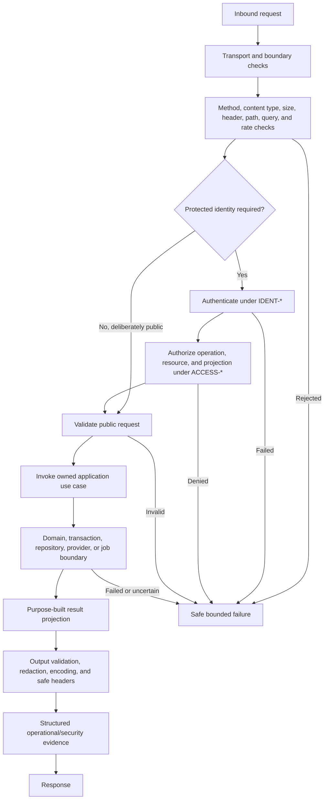
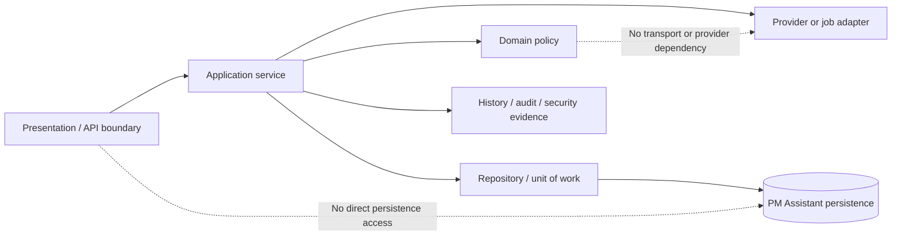

# FleetOS Application, API, and Frontend Security

## Purpose and status

This document defines FleetOS v1.0 security direction for AutoPM and PM Assistant frontends, browsers, APIs, backend boundaries, repositories, transactions, imports, uploads, LINE/webhook integration, notifications, schedulers, and background jobs.

It does not change source code or select an authentication topology, frontend framework, CSP policy, CSRF mechanism, rate limit, upload scanner, queue, worker, proxy, or API gateway.

## Current security implementation evidence

### Frontend and browser

- AutoPM is a static HTML/CSS/JavaScript application that reads transitional feeds and stores payload, timestamp, and custom source URL information in `localStorage`.
- PM Assistant is a FastAPI-served HTML/CSS/JavaScript application calling current unversioned routes.
- Both frontends use dynamic HTML construction. Escaping helpers are used in some flows, but consistent context-safe encoding is not proven.
- No Content Security Policy is evidenced.
- No CSRF control is evidenced.
- PM Assistant settings currently accept credential material in browser forms.
- Current navigation exposes maintenance mutations, imports, settings, notification controls, diagnostics, logs, API testing, and snapshots.

### API and backend

- PM Assistant exposes current unversioned reads and mutations for plans, locations, settings, imports, vehicles, weekly control, completion, task actions, reports, notifications, scheduler controls, diagnostics, logs, and system utilities.
- No proven authentication or authorization dependency is visible on current routes.
- Current CORS permits all origins, methods, and headers with credentials enabled as development convenience.
- Current responses and diagnostics can include credential-derived information, targets, messages, webhook/provider details, filenames, errors, logs, and runtime information.
- FastAPI and Pydantic provide some request typing, and selected status or date checks exist, but a uniform boundary-validation model is not proven.
- Current repository and transaction logic is largely colocated in route functions.

### Imports, providers, and jobs

- CSV/XLSX uploads are read into memory; explicit body-size, row, workbook, parser, and resource ceilings are not evidenced.
- Filename extension influences parsing. Strong content verification, quarantine, malware scanning, and cleanup policy are not evidenced.
- Import preview can create temporary files.
- LINE webhook HMAC comparison exists when a channel secret is configured; absence of the secret permits a development bypass.
- Raw webhook events and notification/provider diagnostics may be persisted.
- External LINE calls use bounded timeouts.
- APScheduler runs in process; safe multi-process execution and durable occurrence identity are not proven.

All items are evidence only, not approved production controls or proof of production exposure.

## Transitional security direction

1. Inventory and classify every route, page, method, input, output, file, provider call, job, log, and diagnostic.
2. Mark routes as deliberately public, protected read, protected command, privileged operation, transitional-only, or prohibited for production exposure.
3. Introduce common identity, authorization, validation, error, redaction, correlation, and bounded-work seams.
4. Create purpose-built read projections rather than exposing tables, ORM models, settings records, or raw diagnostics.
5. Keep AutoPM on approved read-only paths and label transitional data source and staleness.
6. Isolate or disable unsafe diagnostics before protected rollout.
7. Add upload, webhook, provider, scheduler, duplicate, and failure tests in isolated environments.
8. Retain component-specific rollback and safe evidence.

## FleetOS v1.0 target security architecture

## Frontend security direction

### Trust and protected navigation

- The browser is untrusted.
- UI state, hidden controls, disabled buttons, route guards, and navigation menus do not authorize.
- Protected navigation reflects `ACCESS-008` and must handle direct URLs consistently.
- Sensitive data is not fetched before authorization.
- Unauthorized, unavailable, stale, empty, and not-found states remain distinct.
- AutoPM contains no maintenance mutation path or privileged service credential.

### Browser storage restrictions

Under `CTRL-012` and `CTRL-014`:

- credentials, tokens, session material, privileged API secrets, signing material, raw authorization data, and unrestricted sensitive projections are prohibited from browser-readable storage;
- AutoPM cache remains bounded presentation state with source, age, and stale/fallback status;
- cache is invalidated or isolated when access or environment changes as required by `SDEC-009`;
- browser cache is never imported or synchronized into PM Assistant;
- keys and values are treated as attacker-controlled input;
- sensitive PM Assistant command drafts or responses are retained only if explicitly approved.

### XSS and output encoding

`CTRL-013` and `CTRL-016` require:

- context-appropriate encoding for HTML text, attributes, URLs, CSS, and JavaScript contexts;
- safe DOM APIs where practical;
- review of every dynamic HTML construction path;
- sanitization only through an approved, tested approach when rich content is required;
- no unsafe interpretation of import, provider, error, note, location, vehicle, responsibility, or query data;
- safe handling of unknown enum and status values;
- regression tests using Thai, Unicode, markup-like, long, and malformed input.

### Content Security Policy direction

An approved CSP should reduce script, style, frame, object, connection, form, navigation, and mixed-content risk while remaining compatible with the selected frontend and hosting topology.

Exact directives, nonce/hash behavior, reporting, rollout mode, external resources, and legacy inline compatibility remain `SDEC-012`. This Blueprint does not claim CSP is currently present.

## CORS and CSRF direction

### CORS

- Production CORS is restricted to approved origins, methods, headers, credentials behavior, and exposure.
- Wildcard development behavior is not production policy.
- Origin authorization is not user authorization.
- Requests with absent, opaque, or unexpected origins follow an approved policy.
- Browser-direct versus trusted proxy topology remains `SDEC-007`.
- Preflight and failure behavior are tested.

### CSRF

CSRF protection depends on the selected authentication and session topology:

- state-changing browser requests require an approved anti-CSRF design when ambient credentials are possible;
- safe methods remain free of authoritative mutation;
- origin/referrer checks, anti-CSRF tokens, same-site behavior, or other mechanisms are selected only under `SDEC-011`;
- CORS alone is not CSRF protection;
- webhook signature verification and API service authentication are separate from browser CSRF.

## API request security flow

This is a target flow. Current unversioned routes are not claimed to implement it.

## API threat direction

The API boundary must address:

- missing, malformed, expired, or revoked identity;
- broken operation, resource, and field authorization;
- object enumeration and existence disclosure;
- injection and parser abuse;
- oversized or computationally expensive requests;
- filter, sort, cursor, date-range, Unicode, and correlation abuse;
- cache confusion across callers;
- replay and duplicate mutations;
- excessive request rates and automated scraping;
- error, schema, health, or timing disclosure;
- stale, unavailable, ambiguous, or missing data represented incorrectly;
- cross-version or legacy-route policy drift.

## Rate-limit and abuse direction

`CTRL-017` requires an approved request-control model:

- keying by the approved identity and topology;
- separate treatment for public probes, human interactions, AutoPM reads, imports, diagnostics, and protected commands;
- bounded sustained and burst work;
- endpoint or operation weights where needed;
- safe retry guidance;
- no bypass through alternate legacy routes;
- monitoring for repeated failure, enumeration, upload, webhook, or notification abuse.

No numeric limit, threshold, bypass, or vendor is selected. These remain `SDEC-013`.

## Replay and duplicate protection

`CTRL-018` applies to:

- future write commands;
- import preview, confirmation, resume, and replay;
- webhook delivery;
- notification intent and provider attempts;
- scheduler occurrences and retries;
- deployment or recovery actions where repetition can produce harm.

Correlation IDs, timestamps, filenames, local IDs, and process IDs are not business idempotency keys. Exact key format, scope, storage, replay window, and conflict behavior remain `SDEC-014`.

## Error and information-disclosure controls

Public and UI errors:

- use stable safe classifications;
- reveal no stack trace, SQL, paths, hosts, schemas, credentials, credential format, provider secrets, raw payloads, unrestricted targets, or internal topology;
- do not disclose whether a protected resource exists unless approved;
- distinguish invalid, unauthorized, forbidden/not-visible, not found, ambiguous, conflict, unavailable, timeout, rate-limited, and internal failure;
- include a safe correlation reference only after validation;
- never represent dependency failure as a successful empty or zero result.

Detailed diagnostics remain in protected evidence under `DPROT-014`, `CTRL-028`, and approved access.

## Backend security boundaries

The target backend follows:

Requirements:

- route handlers validate, authenticate, authorize, invoke one owned use case, and translate safe results;
- application services own transaction and workflow coordination;
- domain rules own business invariants and status semantics;
- repositories expose only approved aggregate/query responsibilities;
- infrastructure maps provider and persistence errors safely;
- AutoPM has no repository, session, table, schema, backup, or persistence credential.

## Repository and transaction security

- One authoritative command owns one transaction boundary.
- Authorization and expected-state checks occur before mutation.
- Required state and history/audit evidence meet the approved consistency guarantee.
- Read use cases do not perform hidden authoritative writes.
- External notification delivery remains outside the authoritative maintenance transaction.
- Uncertain commit outcomes require reconciliation before retry.
- Concurrency and duplicate-sensitive actions use an approved expected-version or idempotency design.
- Database credentials are scoped to PM Assistant responsibilities and environment.
- Repository methods do not bypass domain or audit rules.

## Import and file-upload security

Under `TRUST-008` and `CTRL-020`, an approved import design must define:

- allowed types and strong content validation;
- request, file, workbook, sheet, row, column, cell, decompression, formula, memory, and processing limits as applicable;
- safe filename handling without trusting client paths;
- encoding and Thai/Unicode behavior;
- parsing isolation and dependency risk;
- quarantine and preview before mutation;
- identity classification and no guessed matches;
- duplicate/replay identity;
- atomic or partial-success policy;
- temporary storage location, access, cleanup, encryption direction, and retention;
- safe row errors without unrestricted source content;
- malware scanning direction if risk and selected environment require it;
- authorization, audit, and rollback.

No scanner or size limit is selected.

## Notification and webhook security

### Webhooks

- Verify provider authenticity under the approved integration contract.
- Absence of required verification in production fails closed.
- Validate body size, content type, JSON shape, events, source fields, and text.
- Define replay and duplicate-event handling.
- Limit provider reply behavior and outbound content.
- Store only minimized event evidence.
- Never expose raw webhook material through ordinary diagnostics.
- Separate provider identity from FleetOS user identity.

### Notifications

- Authorize recipient selection, message purpose, preview, send, retry, and diagnostics.
- Separate maintenance fact, notification intent, provider attempt, and delivery outcome.
- Minimize message content and recipient data.
- Never infer `completion_status` or `pm_workflow_status` from `notification_status`.
- Bound provider timeouts and retries.
- Reconcile ambiguous outcomes before retry where duplication matters.
- Keep non-production recipients and credentials isolated from production.

Provider authentication, signature requirements, recipient policy, retry, and retention remain `SDEC-018`.

## Scheduler and background-job security

Under `TRUST-009` and `CTRL-022`:

- one approved service identity owns each enabled job responsibility;
- a deterministic business occurrence differs from an execution attempt;
- duplicate acquisition cannot create a second accepted business outcome;
- job configuration and enablement are environment-specific and protected;
- retries are bounded and classification-driven;
- authorization failures and business validation failures are not blindly retried;
- interrupted and uncertain work is reconciled;
- graceful shutdown stops new acquisition and preserves recovery evidence;
- job logs exclude secrets, full messages, targets, raw imports, and connection details;
- old and new execution owners do not overlap unsafely during rollout or rollback.

Execution topology, lock mechanism, job IDs, timeouts, retry counts, and alert thresholds remain unresolved.

## Failure, rollout, and rollback

Stop rollout for:

- protected route without identity/access enforcement;
- AutoPM mutation or persistence access;
- unsafe wildcard production CORS;
- missing required CSRF protection;
- credential in browser assets or storage;
- XSS or unsafe dynamic output;
- unbounded upload or request work;
- webhook verification bypass in approved production operation;
- unrestricted settings, logs, snapshots, targets, messages, or provider diagnostics;
- duplicate jobs, imports, notifications, or commands outside approved behavior;
- unsafe error disclosure.

Rollback:

- disables the affected frontend route, endpoint, provider, job, or feature through an approved reversible control;
- retains PM Assistant authority and accepted data;
- preserves security and audit evidence;
- does not reverse-synchronize AutoPM cache;
- does not restore revoked credentials;
- reconciles uncertain effects before replay;
- keeps provider compatibility where safe during consumer rollback.

## Future capabilities outside v1.0

- general AutoPM write commands;
- public or partner write APIs;
- real-time event streaming;
- offline authoritative mutation;
- distributed workflow orchestration;
- multi-tenant API policy;
- mandatory API gateway or service mesh;
- additional notification providers.

## Completion direction

Application security is ready for later implementation when every protected route and input/output surface maps to approved identity, access, data, validation, error, abuse, replay, event, testing, rollout, and rollback controls without violating module ownership.
