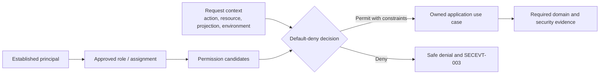

# FleetOS Authorization, Roles, and Access Control

## Purpose and status

This document defines authorization direction for FleetOS v1.0. It covers roles, permissions, least privilege, default deny, separation of duties, protected navigation, API authorization, resource-level access, field projection, administration, and access review.

It does not approve final role names, permission names, group mappings, scope strings, row filters, field rules, disclosure behavior, or policy technology.

## Current security implementation evidence

- Current PM Assistant source contains a local role field and a default `Admin` value.
- AutoPM displays `Fleet Manager` and `Administrator` labels.
- PM Assistant navigation exposes settings, LINE diagnostics, logs, API testing, snapshot, scheduler, imports, reports, and maintenance mutations.
- Frontend controls conditionally show or invoke operations, but client controls are not server authorization.
- Current route definitions do not demonstrate an authorization dependency or resource-access policy.
- Existing local IDs are used in routes and persistence; no proven resource-ownership or row-access enforcement is visible.
- AutoPM is currently a separate read-oriented frontend, but its target read-only authority is an architecture rule rather than proven authentication/authorization enforcement.

These facts do not establish operational roles or permissions.

## Transitional security direction

1. Build an operation inventory for every page, route, use case, job, import, export, setting, diagnostic, notification, log, and recovery action.
2. Identify the authoritative owner, allowed caller class, data projection, environment, and required audit for each operation.
3. Separate ordinary maintenance work from privileged security, configuration, integration, audit, delivery, and recovery actions.
4. Classify current UI items as public, authenticated, privileged, transitional-only, or prohibited for production exposure.
5. Add server-side authorization seams before relying on protected navigation.
6. Introduce purpose-built safe projections before granting AutoPM or operational readers access.
7. Test denied, revoked, cross-resource, cross-environment, and over-privileged cases.

Transitional access must fail closed and must not grant broad administrator access merely to preserve current screens.

## FleetOS v1.0 target security architecture

## Access-control principles

- Authentication and authorization are separate.
- Default deny applies unless an approved policy permits the operation.
- Least privilege applies to both data and actions.
- Authorization occurs at the owning server or service boundary.
- Roles are groupings of approved permissions, not substitutes for explicit resource and projection checks.
- UI navigation communicates access but never enforces it by itself.
- AutoPM read authority never implies PM Assistant command authority.
- Service identities and humans receive separate access assignments where their responsibilities differ.
- Ownership and status semantics cannot be changed by access policy.
- Denial behavior and resource-existence disclosure are deliberate and consistent.

## Access-control requirement registry

| ID | Requirement |
| --- | --- |
| `ACCESS-001` | Every protected operation is denied unless an approved policy explicitly permits the established principal, action, resource, projection, and environment. |
| `ACCESS-002` | Least privilege limits each human and service identity to the minimum approved operations, resources, fields, environments, and duration. |
| `ACCESS-003` | Authentication success never grants broad application, administrative, maintenance, data, provider, or recovery access automatically. |
| `ACCESS-004` | Role names and permission groupings are approved business/security constructs and are not inferred from current labels or local role values. |
| `ACCESS-005` | Permission decisions distinguish read, create, update, transition, complete, correct, reopen, delete/cancel, import, export, notify, schedule, configure, diagnose, audit, deploy, and recover actions as applicable. |
| `ACCESS-006` | AutoPM maintenance access is read-only and cannot grant command, persistence, import, notification, scheduler, settings, diagnostic, or administrative authority. |
| `ACCESS-007` | PM Assistant remains the only authoritative maintenance workflow boundary regardless of caller role. |
| `ACCESS-008` | Protected navigation and components reflect server-authoritative access but hidden, disabled, or absent UI never substitutes for enforcement. |
| `ACCESS-009` | API authorization occurs before protected use-case execution and before sensitive projection generation. |
| `ACCESS-010` | Resource-level authorization prevents access to an unapproved plan, history, import, notification, user, setting, log, job, vehicle, location, or other protected resource. |
| `ACCESS-011` | Field-level projection includes only fields required for the approved purpose and caller; omission and redaction preserve contract meaning. |
| `ACCESS-012` | Resource-existence disclosure, including `403` versus `404` behavior, follows one approved policy and does not leak protected inventory. |
| `ACCESS-013` | Privileged settings, credential, diagnostic, audit, deployment, backup, restore, and incident actions require explicitly approved administrative permissions. |
| `ACCESS-014` | Separation of duties prevents one role or identity from silently requesting, approving, executing, and concealing a sensitive action where business risk requires separation. |
| `ACCESS-015` | Temporary, emergency, delegated, and exception access has an owner, purpose, scope, expiry, review, revocation, and safe evidence. |
| `ACCESS-016` | Access provisioning, change, denial, elevation, review, and revocation produce safe security events without storing credentials. |
| `ACCESS-017` | Periodic and event-driven access review covers human, service, privileged, inactive, orphaned, cross-environment, and external-provider access. |
| `ACCESS-018` | Authorization rollout and rollback preserve PM Assistant authority, denied-state safety, audit evidence, and revoked access. |

## Conceptual role and permission model

The target model uses three layers:

1. **Principal** — established human or service identity under `IDENT-*`.
2. **Role or assignment** — approved grouping or responsibility context.
3. **Permission decision** — action plus resource plus projection plus environment constraints.

This model does not approve role names or require role-based access control as the only implementation technique. Attribute, relationship, policy, or combined approaches remain possible under `SDEC-005` and `SDEC-006`.

## Role direction

The Product Owner must approve role vocabulary and assignments. Candidate responsibility classes may need to distinguish:

- fleet read users;
- maintenance operators or planners;
- maintenance approvers if required;
- location or master-data operators;
- import operators and import approvers;
- notification/settings administrators;
- identity/access administrators;
- audit/security reviewers;
- delivery, recovery, or incident operators;
- service identities.

These are responsibility areas, not approved role names. No current `Admin`, `Administrator`, or `Fleet Manager` label is adopted by this Blueprint.

## Permission direction

Permissions should be purpose-specific and stable enough to test. A future matrix must state:

- protected action;
- owning module and use case;
- allowed principal class or role;
- resource and field scope;
- environment;
- required preconditions and separation of duties;
- audit/security event;
- denial and disclosure behavior;
- temporary-access and revocation behavior.

Generic `read` or `admin` access is insufficient when it would expose settings, targets, diagnostics, audit, provider responses, raw imports, or credential-adjacent data.

## Least privilege and default deny

Default deny applies when:

- no identity is established for a protected boundary;
- a role or permission is absent, expired, revoked, or ambiguous;
- the resource is outside the approved scope;
- the requested projection contains unapproved sensitive fields;
- the environment or audience is wrong;
- a service identity attempts a human operation or the reverse;
- current UI visibility conflicts with server policy;
- policy or required configuration is unavailable.

Unavailable authorization infrastructure must not be converted into broad allow behavior. Exact degraded-mode behavior remains `SDEC-005`.

## Separation of duties

Separation should be considered for:

- identity request, approval, provisioning, and review;
- role/policy administration and audit review;
- import preparation, confirmation, and exception approval;
- notification recipient configuration and message/send approval;
- secret issuance and application operation;
- artifact approval and protected-environment promotion;
- backup creation and restore authorization;
- vulnerability acceptance and verification;
- incident evidence handling and recovery approval.

The selected separation must reflect FleetOS scale and business risk without inventing unnecessary organizational structure. Required combinations remain `SDEC-006`.

## Protected navigation direction

- Navigation is generated or filtered from approved access context.
- Direct URL or API access receives the same server-side decision.
- Deep links preserve safe return behavior after authentication or denial.
- Unauthorized pages do not preload sensitive data.
- Cached page state is cleared or invalidated when access changes as required by the selected design.
- An inaccessible page is distinct from unavailable data and a valid empty result.
- AutoPM cannot expose a hidden mutation route.

## API authorization direction

For the proposed `/api/v1` read boundary:

- production anonymous access is not approved;
- caller topology and service/human identity remain `SDEC-007` and `SDEC-008`;
- each endpoint and projection is separately authorized;
- PM history, synchronization, import, notification, and audit may require narrower access than ordinary dashboard data;
- health and readiness exposure is separately decided and remains minimal;
- authorization-sensitive responses are not placed in unsafe shared caches;
- current unversioned routes receive no implied v1 access policy;
- correlation IDs never authenticate or authorize.

No final scope string is defined here.

## Resource-level and field-level access

Resource access applies even when an identifier is valid. The backend must check whether the principal may access the specific resource and purpose.

Protected resource examples include:

- PM plan details and history;
- person/responsibility information;
- location address or notes;
- import batches and row errors;
- notification targets and provider results;
- webhook events;
- settings and feature state;
- system logs and diagnostics;
- security events and audit;
- backups and recovery evidence.

Local integer IDs, opaque API IDs, `vehicle_no`, and future `fleetos_vehicle_id` never grant access by possession.

Field projection must:

- exclude credentials and raw authentication material;
- minimize personal and provider data;
- omit or redact sensitive fields only under a documented contract;
- avoid returning stored secrets for unchanged settings;
- prevent broad ORM or table serialization;
- preserve the distinction among the four status domains.

## Access-review direction

Access reviews occur:

- periodically at a cadence approved under `SDEC-021`;
- after role, employment/responsibility, service, environment, architecture, or provider changes;
- after credential compromise or a material incident;
- before retiring a transitional access path;
- when inactive, orphaned, shared, over-privileged, or cross-environment access is detected.

Evidence should include principal reference, role/permissions, resource/environment scope, owner, reviewer, decision, expiry or follow-up, and timestamp without credential values.

## Failure and rollback

Stop rollout for:

- any AutoPM write authority;
- direct database access;
- broad anonymous protected access;
- client-only authorization;
- cross-resource access;
- access to credentials or unrestricted diagnostics;
- inability to revoke a principal or service identity;
- policy failure that defaults to allow.

Rollback disables or restores a known-safe access policy or application version while retaining denied-state safety, current revocations, required evidence, and authoritative ownership. It must not restore an obsolete broad role merely to recover UI compatibility.

## Future capabilities outside v1.0

- multi-tenant policy partitioning;
- delegated external customer administration;
- general AutoPM maintenance commands;
- public partner API authorization;
- advanced just-in-time privilege automation;
- enterprise-wide policy federation.

## Completion direction

Authorization design is ready for implementation when the role/permission matrix, service access, disclosure policy, separation of duties, access review, security events, tests, rollout, and rollback are approved and every `ACCESS-*` requirement is traceable.
