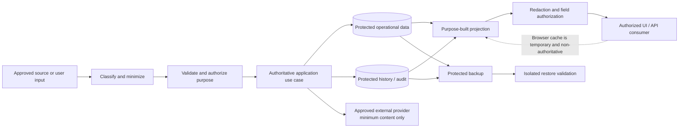

# FleetOS Data Protection, Privacy, and Retention

## Purpose and status

This document defines FleetOS v1.0 data classification, sensitive-field handling, minimization, encryption direction, retention, deletion, backup security, audit protection, and privacy direction.

It does not select encryption algorithms, key-management providers, retention periods, legal bases, jurisdictions, compliance certifications, archival technology, deletion schedules, or legal-hold processes.

## Current security implementation evidence

Current repository evidence includes:

- authoritative maintenance plans, task state, weekly control, history, imports, notification evidence, targets, provider responses, webhook payloads, settings, users, locations, and vehicle information in PM Assistant persistence;
- generic settings that may contain LINE credential material and provider configuration;
- history fields capable of storing before/after JSON;
- notification records capable of storing targets, messages, provider responses, and diagnostic details;
- webhook records capable of storing raw payloads and provider source identifiers;
- import records capable of storing filenames and row errors;
- diagnostic routes and screens capable of presenting settings, targets, messages, provider details, webhook events, logs, and snapshots;
- AutoPM browser cache containing source payload and synchronization metadata;
- local SQLite persistence without proven production encryption, database roles, backup, restore, retention, deletion, or privacy enforcement;
- repository documentation requiring minimization, redaction, protected backups, and explicit retention decisions.

The presence of fields is evidence only. It does not approve their production collection, storage, exposure, export, logging, or retention.

## Transitional security direction

1. Inventory each sensitive field, source, owner, reader, writer, purpose, location, copy, export, log, backup, and external-provider transfer.
2. Classify current settings, diagnostics, webhook, notification, import, history, user, responsibility, address, note, and free-text fields.
3. Replace broad ORM/settings/diagnostic exposure with purpose-built projections.
4. Stop adding raw credentials, unrestricted payloads, or unnecessary message bodies to new evidence.
5. Define redaction and minimization tests before production integration.
6. Preserve current authoritative and historical evidence while retention, correction, and deletion decisions are approved.
7. Treat browser cache and transitional files as bounded copies, never authoritative sources.
8. Rehearse backup and restore using isolated approved data before claiming protection.

Transition must not delete potentially required evidence merely to reduce current risk without an approved preservation and correction plan.

## FleetOS v1.0 target security architecture

## Data classification model

| Class | Direction | Examples |
| --- | --- | --- |
| Public | Explicitly approved for unrestricted release. Default assumption is that FleetOS operational data is not public. | Deliberately public documentation or coarse public status if approved. |
| Internal | Routine operational information limited to approved workforce or service use. | Non-sensitive application metadata and approved aggregate views. |
| Confidential | Business, personal, maintenance, operational, provider, import, history, or diagnostic information requiring purpose-based access. | Plans, notes, locations, responsibilities, detailed history, imports, targets. |
| Restricted security material | Material whose exposure can enable access, impersonation, compromise, or recovery bypass. | Credentials, session material, signing secrets, authorization headers, recovery material, sensitive security evidence. |

Classification is purpose- and field-specific. A single record or file may inherit the highest applicable classification.

## Data-protection requirement registry

| ID | Requirement |
| --- | --- |
| `DPROT-001` | Every stored, transmitted, displayed, logged, exported, cached, backed-up, or externally shared field has an approved purpose, owner, classification, readers, writers, and lifecycle direction. |
| `DPROT-002` | Public release is explicit; unclassified FleetOS operational data defaults to protected internal handling until reviewed. |
| `DPROT-003` | Restricted security material never appears in public responses, ordinary application projections, browser-readable storage, source, logs, audit, documentation, screenshots, fixtures, or exports. |
| `DPROT-004` | Sensitive-field projections expose only the minimum fields necessary for the approved caller and purpose. |
| `DPROT-005` | Data collection and processing are minimized; optional free text, raw payloads, full messages, provider responses, and duplicated snapshots require specific justification. |
| `DPROT-006` | Original source evidence and normalized/derived values remain distinguishable, with provenance and rule version where required by existing data and identity contracts. |
| `DPROT-007` | Protected production transport uses an approved encryption-in-transit design at every required trust boundary. |
| `DPROT-008` | Applicable production data, secrets, logs, exports, backups, and recovery evidence use an approved encryption-at-rest and key-management design. |
| `DPROT-009` | Encryption keys and protected data have separate ownership and access boundaries where supported by the approved design; keys are never embedded with public artifacts. |
| `DPROT-010` | Retention is defined per data class and purpose for operational records, history, audit, security events, logs, imports, notifications, webhooks, diagnostics, browser cache, exports, temporary files, and backups. |
| `DPROT-011` | Deletion, archival, correction, anonymization, tombstone, legal hold, and backup-expiration behavior are explicit and preserve authoritative integrity. |
| `DPROT-012` | Backup copies are access-controlled, encrypted under the approved design, integrity-checked, isolated from ordinary mutation, and trusted only after restore validation. |
| `DPROT-013` | Restore and recovery preserve ownership, identities, all four status domains, history, audit, security events, and required deletion/retention state. |
| `DPROT-014` | Audit and security evidence are protected from unauthorized access, alteration, deletion, disclosure, and untraceable correction. |
| `DPROT-015` | Personal, responsibility, recipient, location, note, message, and free-text data receive privacy-purpose, access, minimization, correction, export, and deletion review. |
| `DPROT-016` | Data transfer to an external provider is limited to approved content, recipient, purpose, environment, credential, timeout, and retention behavior. |
| `DPROT-017` | Non-production data is synthetic or approved and sanitized where practical; production data is not copied without explicit protection and approval. |
| `DPROT-018` | Data-protection rollout and rollback preserve required evidence and never make AutoPM cache, legacy feeds, or restored stale data authoritative. |

## Asset and field handling

### Authoritative maintenance data

`ASSET-001` and `ASSET-002` require integrity and availability as well as confidentiality. Protection must preserve:

- PM plan and workflow information;
- separate `pm_mileage_status`, `pm_workflow_status`, `completion_status`, and `notification_status`;
- completion and correction evidence;
- history, import, synchronization, scheduler, and notification relationships;
- source and freshness;
- original and superseded evidence.

An encryption or deletion mechanism must not collapse status domains, renumber accepted identifiers, or transfer authority.

### Identity and responsibility data

`ASSET-003` must keep:

- authenticated identity separate from display name;
- responsibility assignment separate from permission;
- lifecycle and access evidence minimized;
- current local usernames and labels from being promoted into enterprise identity without approval.

### Vehicle and location information

`ASSET-004` follows the existing data and identity contracts:

- `vehicle_no` remains transitional;
- `fleetos_vehicle_id` remains proposed and unimplemented;
- original Thai and Unicode values are preserved;
- ambiguous identity is quarantined;
- location addresses, notes, and organizational mappings are exposed only when required.

### Credentials and security material

`ASSET-005` is always restricted security material. Returning a stored secret to a general settings page is not target behavior. Masking reduces display but does not make credential-derived material safe for unrestricted logs or diagnostics.

### Logs, diagnostics, imports, and provider evidence

`ASSET-008`, `ASSET-009`, and `ASSET-011` require field-level review because filenames, row errors, targets, messages, payloads, provider responses, paths, source IDs, and notes can contain personal, business, or security-sensitive content.

## Sensitive-data flow

This flow is conceptual. Storage layout, encryption, key ownership, retention, and external-provider behavior remain unresolved.

## Data minimization and sensitive-field handling

Default public or ordinary application projections exclude:

- passwords, tokens, API keys, signing secrets, session identifiers, cookies, authorization headers, recovery material, and connection strings;
- complete provider targets or identity values unless the approved task requires them;
- raw webhook payloads and unrestricted provider responses;
- full notification message bodies unless specifically authorized;
- raw import rows and uploaded file contents;
- unrestricted filenames, local paths, hosts, schemas, engine details, and topology;
- raw before/after history blobs where a safer structured event is sufficient;
- unnecessary actor names, free-text notes, addresses, or responsibility details;
- stack traces, SQL, exception internals, or secret-derived diagnostics.

Sensitive update screens should accept replacement values without returning the stored value where the selected mechanism allows. Exact write-only, placeholder, confirmation, and rotation UX remains `SDEC-010`.

## Encryption in transit

`DPROT-007` requires protected transport at approved production boundaries, including as applicable:

- user/browser to AutoPM or PM Assistant;
- AutoPM to the approved PM Assistant read boundary;
- application to persistence;
- application to external providers;
- operator, deployment, monitoring, backup, and recovery access.

Exact protocols, termination points, certificates, internal transport, trust stores, and renewal remain `SDEC-015`. Current use of an HTTPS provider endpoint is evidence for that outbound call only and does not prove end-to-end FleetOS transport protection.

## Encryption at rest and key direction

`DPROT-008` and `DPROT-009` require an approved design for:

- authoritative persistence;
- credentials and configuration secrets;
- logs and security evidence;
- temporary uploads and generated exports;
- backups and recovery artifacts;
- local developer or operational copies where sensitive data is approved.

The design must define key authority, generation or acquisition, delivery, access, rotation, revocation, backup, recovery, loss, compromise, and deletion. No algorithm or provider is selected by this Blueprint.

## Retention, deletion, and privacy

`SDEC-016` and `SDEC-017` must resolve:

- business, security, operational, privacy, and recovery purpose;
- retention start event and period;
- archival and access changes;
- correction, deletion, anonymization, or tombstone behavior;
- history and audit immutability or compensating corrections;
- browser cache expiry;
- upload, temporary file, export, snapshot, and diagnostic cleanup;
- external-provider copies;
- backup expiration and restore interaction;
- legal hold if applicable;
- owner, approval, evidence, and exception process.

Deletion of an application record does not prove deletion from logs, audit, backups, exports, browser cache, temporary files, or providers. Each copy requires explicit treatment.

Privacy direction requires:

- a defined purpose before collecting personal or responsibility data;
- the minimum required fields;
- controlled access and disclosure;
- accurate correction and mapping;
- safe handling of free text;
- review of exports, notifications, screenshots, diagnostics, and test data;
- approved request, exception, and incident handling.

No legal basis or regulatory regime is asserted.

## Backup security

Backups must:

- remain within PM Assistant authority;
- exclude AutoPM cache as an authoritative source;
- use approved access and encryption controls;
- be isolated from ordinary application mutation and compromised credentials where the design permits;
- have integrity evidence and identifiable scope;
- be restored only into an isolated approved destination during validation;
- reconcile identities, statuses, history, audit, security events, Unicode, dates, and application compatibility;
- follow approved retention and secure disposal;
- never be described as successful solely because a backup file exists.

## Audit-data protection

Domain audit, security events, and operational logs have different purposes and may require different access, immutability, correction, and retention rules.

Audit protection must:

- record the minimum safe actor/process, action, resource, result, time, and correlation/causation reference;
- exclude raw credentials and unnecessary payloads;
- protect against untraceable edits and deletion;
- use compensating or superseding evidence for correction where appropriate;
- restrict bulk export;
- support incident and access review without exposing unrelated sensitive data.

## Failure and rollback

Stop rollout for:

- credentials or session material in responses, browser storage, logs, audit, exports, or artifacts;
- unrestricted raw webhook, notification, history, import, or diagnostic exposure;
- inability to classify or redact a proposed field;
- backup without protected access or restore validation;
- deletion that loses required authoritative or audit evidence;
- stale restoration that silently overwrites accepted state;
- production data copied to an unapproved environment.

Rollback restores a known-safe application, projection, configuration, or rule version while preserving current revocations, accepted maintenance evidence, and required audit. It never restores compromised keys or secrets and never promotes AutoPM cache or a legacy feed to authority.

## Future capabilities outside v1.0

- formal enterprise data-loss-prevention platforms;
- automatic legal-hold orchestration;
- cross-region key and backup architecture;
- privacy self-service portals;
- formal compliance certification;
- enterprise records-management integration.

## Completion direction

Data-protection design is ready for implementation when every sensitive field and copy is classified, required `SDEC-*` decisions are approved, and all `DPROT-*` requirements map to access, encryption, retention, privacy, backup, audit, validation, rollout, and rollback evidence.
