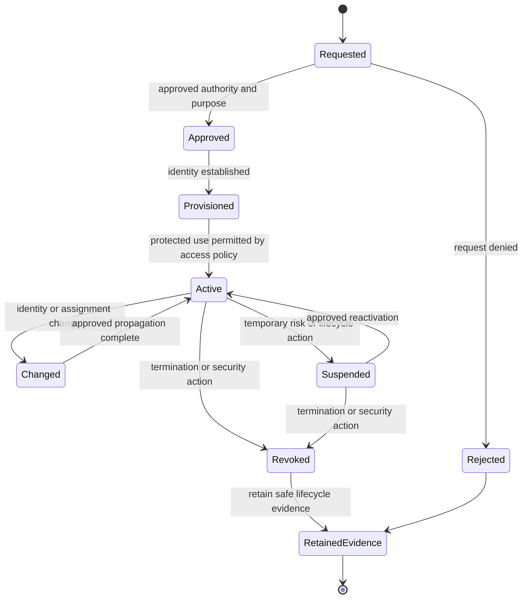
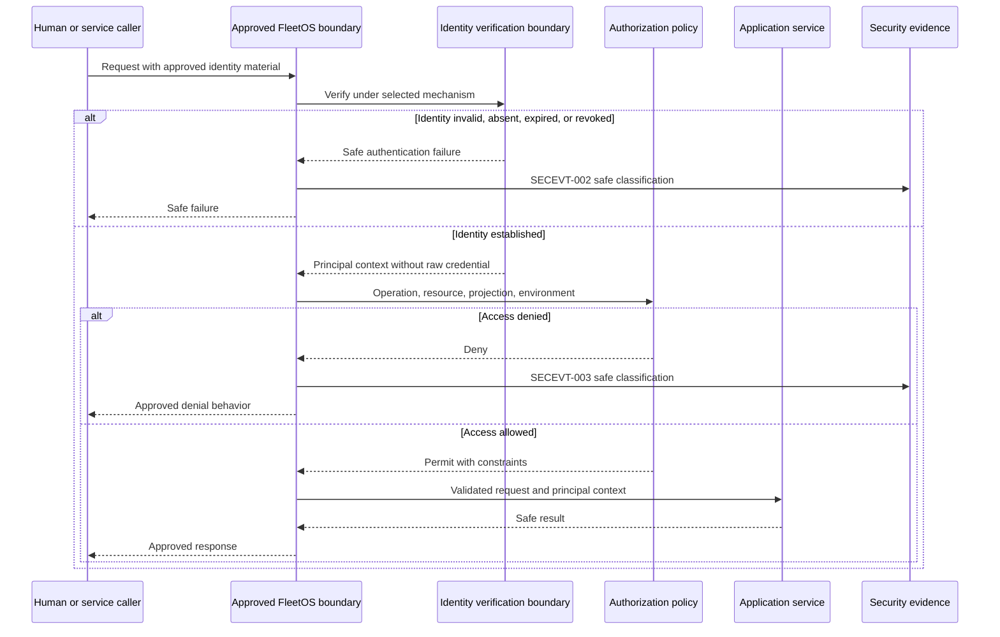
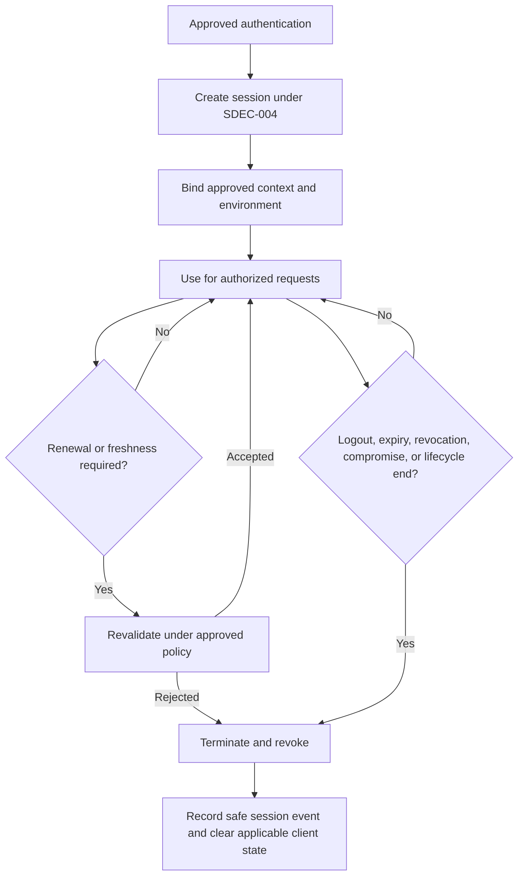

# FleetOS Identity, Authentication, and Session

## Purpose and status

This document defines FleetOS v1.0 identity, authentication, session, credential, and service-identity requirements. It does not select or implement an identity provider, directory, OAuth, OIDC, SAML, JWT, API key, cookie, password, MFA, token, certificate, signing algorithm, session duration, or recovery mechanism.

## Current security implementation evidence

- PM Assistant has a local `user_master` structure with username, display name, role, and active flag.
- Startup behavior creates a default administrator-labelled record when it is absent.
- AutoPM visibly presents a user name and administrator label.
- PM Assistant settings screens accept LINE credential material.
- Current source contains no proven login, logout, password verification, authenticated principal, session middleware, or route-level authorization dependency.
- Current user, role, and display labels are implementation evidence only and are not enterprise identity, authentication, or permission proof.
- Current LINE settings and webhook identity are provider-integration evidence, not FleetOS user authentication.
- Correlation values, vehicle identifiers, notification targets, source IDs, and browser cache keys are not user or service identities.

Production authentication, session security, and identity lifecycle are therefore not proven operational.

## Transitional security direction

1. Inventory every current human label, service process, scheduler, provider, route, settings operation, diagnostic action, and data owner.
2. Separate display names, free-text responsibility values, local usernames, provider target IDs, and enterprise identity candidates.
3. Classify which boundaries are intentionally public and which require an authenticated principal.
4. Introduce an identity context seam at protected PM Assistant and API boundaries before enforcing detailed permissions.
5. Prevent new credentials from being returned through general settings projections or stored in browser-accessible locations.
6. Preserve current workflows in an isolated environment while failed, absent, revoked, and malformed identity cases are tested.
7. Keep current local user records as transitional evidence until identity authority and migration rules are approved.

Transition must not map a display name or responsibility string automatically to an authenticated person.

## FleetOS v1.0 target security architecture

### Identity model

FleetOS distinguishes:

| Identity class | Direction |
| --- | --- |
| Human identity | Represents an approved person or workforce identity under `SDEC-001`; not inferred from display text. |
| Service identity | Represents an approved non-human caller, job owner, integration, or delivery process under `SDEC-008`. |
| Provider identity | Represents an external integration source or target; it does not grant FleetOS access automatically. |
| Responsibility assignment | Business assignment to a person or team; it remains separate from authentication and permission. |
| Display label | Presentation-only name that carries no security authority. |
| Local resource identifier | Identifies an application record only; it does not establish a security principal. |

`vehicle_no` and proposed `fleetos_vehicle_id` are vehicle identity concepts, never authentication principals.

## Identity requirement registry

| ID | Requirement |
| --- | --- |
| `IDENT-001` | Every protected human or service action is associated with an approved principal established at a documented trust boundary. |
| `IDENT-002` | Display names, free-text responsibility labels, local usernames, provider targets, vehicle identifiers, and correlation IDs never establish identity by themselves. |
| `IDENT-003` | Human, service, provider, and responsibility identities remain distinct and use explicit mappings where interaction is approved. |
| `IDENT-004` | Identity provisioning requires an approved authority, purpose, requested access, accountable approver, and traceable result. |
| `IDENT-005` | Identity changes, suspension, termination, revocation, and reactivation propagate to protected access under an approved lifecycle. |
| `IDENT-006` | Authentication establishes identity only; it does not grant operation, resource, field, environment, or administrative permission automatically. |
| `IDENT-007` | Authentication failures reveal no credential structure, user existence, secret value, validation internals, or unnecessary topology. |
| `IDENT-008` | Credential issuance, delivery, storage, use, rotation, revocation, recovery, and compromise handling occur through approved protected boundaries. |
| `IDENT-009` | Credentials and authentication material never appear in source, static assets, URLs, browser-readable storage, logs, documentation, audit, exports, screenshots, or test fixtures. |
| `IDENT-010` | A session has an approved creation, binding, use, renewal, termination, expiry, revocation, and abnormal-event lifecycle. |
| `IDENT-011` | Session state resists theft, fixation, replay, cross-environment use, unintended sharing, and continuation after applicable revocation. |
| `IDENT-012` | Logout or equivalent termination invalidates the approved session scope and removes browser-held material as required by the selected design. |
| `IDENT-013` | Sensitive or privileged actions may require an approved freshness or reauthentication decision without assuming a specific mechanism. |
| `IDENT-014` | Service identities receive only the authority, environment, audience, lifetime, and secret access required for one approved responsibility. |
| `IDENT-015` | Authentication, credential, session, and service-identity lifecycle events produce safe evidence through the applicable `SECEVT-*` records. |
| `IDENT-016` | Identity migration and rollback preserve provenance, revocation, audit, and access safety and never restore compromised material. |

## Identity lifecycle

The lifecycle is conceptual. Exact identity sources, approval workflows, propagation times, and retention remain `SDEC-001`, `SDEC-002`, and `SDEC-021`.

## Authentication direction

Before production exposure:

- classify the caller as human, service, provider, probe, or deliberately public traffic;
- select an approved mechanism under `SDEC-003`;
- establish trust termination and proxy behavior under `SDEC-007`;
- validate credential audience, environment, state, and applicable freshness;
- fail closed when identity cannot be established at a protected boundary;
- translate failures into safe responses and `SECEVT-002`;
- pass an internal principal context to authorization without exposing raw credentials;
- prevent application code from treating a correlation ID, request header presence, browser route, or client-calculated role as authentication.

### Authentication and authorization flow

This flow is target direction. No current route is claimed to implement it.

## Session direction

### Session lifecycle

Session requirements:

- session state is scoped to the approved caller, environment, and audience;
- client storage behavior follows the selected topology and `CTRL-014`;
- session identifiers contain no personal or business meaning;
- session material is never logged;
- renewal does not silently bypass identity suspension or credential revocation;
- simultaneous-session, inactivity, absolute-lifetime, device, and reauthentication rules remain `SDEC-004`;
- CSRF behavior is selected with the session mechanism under `SDEC-011`;
- session rollback does not reactivate a revoked credential or compromised session.

## Credential handling

Credentials include any material that can establish or strengthen access, including future human, service, provider, session, signing, encryption, recovery, or deployment material.

Required direction:

1. Generate or issue credentials only at an approved protected boundary.
2. Deliver them only to the intended identity or runtime.
3. Store them outside source, static artifacts, general settings projections, browser-readable storage, logs, and documentation.
4. Limit their environment, audience, purpose, privilege, and lifetime.
5. Validate required configuration without returning or logging the value.
6. Rotate or revoke through the responsible authority.
7. Treat suspected exposure as a security event even when a displayed value was partially masked.
8. Never restore a revoked credential during rollback.
9. Use safe placeholders in examples and tests.

Password rules, MFA rules, recovery proof, token format, credential lifetime, signing, and storage mechanisms remain unresolved.

## Service identity direction

Service identities may be required for:

- an approved AutoPM-to-PM Assistant topology;
- scheduler or background execution;
- notification/provider access;
- controlled import or synchronization;
- build, deployment, migration, backup, restore, monitoring, or recovery tooling.

Each service identity must:

- own one documented responsibility;
- use only approved environment-specific authority;
- avoid shared human credentials;
- avoid long-lived privileged material in browsers;
- have explicit issuance, deployment, rotation, revocation, and incident ownership;
- produce safe lifecycle evidence;
- be disabled when its responsibility is disabled or retired.

Service-identity formats and the browser-direct versus trusted AutoPM proxy topology remain `SDEC-007` and `SDEC-008`.

## Failure, incident, and rollback

Authentication or session failure must not:

- fall back to anonymous protected access;
- reuse a stale client role;
- expose validation internals;
- convert unauthorized data into a successful empty result;
- authorize a different resource;
- keep a revoked session active.

Credential-compromise handling follows `THREAT-004`, `SECEVT-004`, and the incident flow in [Threat Model, Incident, and Audit](THREAT_MODEL_INCIDENT_AND_AUDIT.md).

Rollback may restore a known-safe compatible authentication implementation or configuration, but it must not restore revoked credentials, reopen anonymous access, erase identity evidence, or change PM Assistant authority.

## Future capabilities outside v1.0

- broad enterprise federation beyond approved FleetOS access;
- consumer identity or public self-registration;
- multi-tenant identity partitioning;
- delegated third-party administration;
- passwordless, device-trust, or adaptive-risk requirements unless separately approved;
- cross-enterprise service mesh identity.

## Completion direction

Identity design is ready for later implementation when all `IDENT-*` requirements are mapped to resolved `SDEC-*` decisions, selected controls, protected boundaries, safe error behavior, security events, tests, rollout, and rollback evidence.
