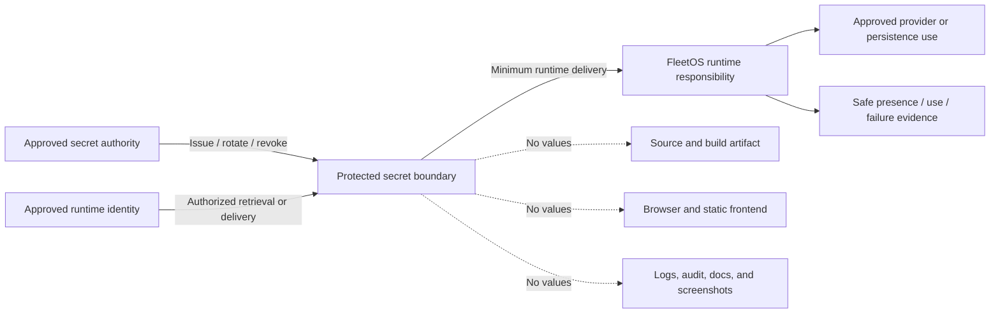
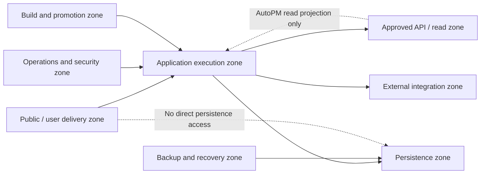

# FleetOS Infrastructure, Secrets, and Supply Chain

## Purpose and status

This document defines FleetOS v1.0 security direction for secrets, configuration, dependencies, build artifacts, environment isolation, network zones, logging, delivery, backup access, and supply-chain risk.

It does not select a cloud, secret manager, identity provider, certificate authority, scanner, package registry, CI/CD platform, container system, database, monitoring provider, network product, signing technology, or deployment topology.

## Current security implementation evidence

- `.env.example` lists environment-variable names with placeholders.
- `.env`, the local database filename, and log directories have repository ignore rules.
- PM Assistant currently stores selected LINE credentials and configuration through a generic settings table and settings UI.
- Current settings and diagnostics can return credential-derived or provider-sensitive information to the browser.
- Runtime source includes a hard-coded local SQLite connection shape and local filesystem directories for logs, temporary imports, and snapshots.
- Dependencies use minimum-version declarations; no lockfile, SBOM, dependency scanner, provenance record, or automated update policy is proven.
- No established GitHub Actions workflow or FleetOS CI/CD pipeline is evidenced.
- `.github/CODEOWNERS` exists, but code ownership alone is not delivery or security approval.
- No production environment topology, network segmentation, TLS termination, secret delivery, artifact integrity, centralized logging, alerting, backup, restore, or access-control implementation is proven.

Environment-variable names, deployment-oriented documentation, and provider mentions are evidence or direction only. Values were not inspected and must not be reproduced.

## Transitional security direction

1. Inventory configuration names, settings records, credentials, local files, dependencies, build steps, artifacts, environments, external targets, and operational access.
2. Classify configuration as public build-time, non-secret runtime, sensitive runtime, credential, or restricted recovery material.
3. Remove secret-return behavior from future general settings projections.
4. Establish environment-specific configuration validation without echoing values.
5. Isolate non-production data, recipients, credentials, and provider targets.
6. Create dependency and artifact inventories before selecting automation.
7. Define conceptual network and operator boundaries before production exposure.
8. Validate safe logging, backup access, restore, rollback, and credential compromise.

Transition does not authorize moving current values, rotating credentials, changing environments, or adopting a vendor.

## FleetOS v1.0 target security architecture

## Secret-management direction

Secrets include future human, service, provider, database, deployment, signing, encryption, backup, monitoring, and recovery material.

Under `CTRL-023`:

- secrets are generated or issued only by an approved authority;
- delivery occurs through an approved protected boundary;
- source, commits, static artifacts, browser code, URLs, logs, audit, documentation, screenshots, fixtures, and ordinary settings responses never contain values;
- runtime access is limited by identity, environment, purpose, and least privilege;
- applications validate presence and usability without echoing values;
- rotation and revocation have accountable owners and safe evidence;
- old and new values overlap only under an approved rotation plan;
- rollback never restores a revoked or compromised value;
- local development uses approved non-production material and isolation.

The selected storage, injection, refresh, rotation, and break-glass mechanisms remain `SDEC-010`.

## Secret delivery boundary

This diagram is conceptual and does not require runtime secret retrieval or a particular product.

## Configuration security

Configuration must be:

- typed and validated at an explicit runtime boundary;
- separated from domain and presentation logic;
- classified as secret or non-secret;
- scoped to module, responsibility, environment, and version;
- fail-safe when required values are missing, malformed, or inconsistent;
- reported through names and safe classifications only;
- protected from unreviewed browser or diagnostic exposure;
- traceable to an approved change without embedding values in evidence.

Feature switches and security policy configuration:

- default to the approved safe state;
- do not silently disable authentication, authorization, webhook verification, redaction, or logging;
- have owner, purpose, environment, rollout, expiry/retirement, and rollback direction;
- are not treated as substitutes for code or policy validation.

Exact configuration precedence, reload behavior, validation timing, and administration remain `SDEC-010` and `SDEC-019`.

## Dependency and supply-chain security

Under `CTRL-026`, FleetOS later implementation must:

1. inventory direct and transitive dependencies for Python, browser assets, Apps Script, build tools, and operational tooling;
2. identify source, version, license direction, maintainer/provenance information where available, and affected module;
3. constrain versions through an approved reproducibility strategy;
4. review new dependencies for necessity, maintenance, security history, privilege, network behavior, and alternatives;
5. perform approved vulnerability and integrity checks;
6. prioritize remediation by exploitability, exposure, asset, and business impact;
7. test upgrades for API, data, Unicode, scheduler, import, notification, and frontend compatibility;
8. record accepted exceptions with owner and review date;
9. remove or isolate unused dependencies through approved scope;
10. avoid downloading executable or build inputs from unapproved sources.

No scanner, feed, severity policy, update cadence, or lockfile format is selected. These remain `SDEC-020`.

## Build-artifact integrity direction

Under `CTRL-027`, a candidate artifact must be:

- built from reviewed source and approved dependency inputs;
- uniquely identifiable and traceable to validation evidence;
- immutable or protected from untraceable change after approval;
- free of baked-in environment secrets and privileged endpoints;
- checked for expected contents and prohibited sensitive material;
- promoted separately for AutoPM and PM Assistant;
- compatible with approved configuration, persistence, API, and rollback;
- integrity-verified before protected deployment.

Signing, attestation, SBOM, reproducible-build, registry, and artifact-retention mechanisms remain `SDEC-020`.

## Environment isolation

Development, test, staging, and production are logical security boundaries even if their physical topology remains unresolved.

Isolation must address:

- identity and privileged access;
- credentials and cryptographic material;
- data and backups;
- provider targets and recipients;
- API origins and endpoints;
- scheduler and notification enablement;
- feature and diagnostic configuration;
- logs, monitoring, alerts, and incident routing;
- artifact promotion;
- recovery and rollback authority.

Staging or test must not silently target production data, persistence, recipients, webhooks, or credentials. Production data is not copied without explicit approved protection under `DPROT-017`.

## Network trust zones

The v1 target defines logical zones without selecting subnets, firewalls, gateways, or hosting:

| Zone | Direction |
| --- | --- |
| Public/user delivery | Exposes only approved frontend and deliberately public/protected entry points. |
| Application execution | Runs AutoPM delivery and PM Assistant responsibilities with environment-specific identity and configuration. |
| API/read boundary | Permits only approved consumer flows and purpose-built projections. |
| Persistence | Accepts only PM Assistant-owned access; AutoPM has no route or credential. |
| External integration | Restricts outbound provider destinations and inbound verified webhooks. |
| Operations and security | Restricts settings, logs, diagnostics, monitoring, access administration, and incident actions. |
| Build and promotion | Protects source inputs, dependencies, artifacts, approvals, and environment promotion. |
| Backup and recovery | Isolates backups, restore destinations, recovery credentials, and evidence. |

Exact ingress, egress, DNS, proxy, TLS, firewall, private-network, and operator-access design remains `SDEC-015` and `SDEC-019`.

## Logging and redaction

Under `CTRL-028`, operational logs should use:

- explicit-timezone timestamp;
- severity;
- FleetOS module and component;
- stable event name;
- safe operation or resource reference;
- validated correlation;
- result and duration;
- safe error classification;
- application/configuration version where approved.

Logs exclude:

- credentials, tokens, cookies, authorization headers, connection strings, and secret-derived values;
- full notification targets, message bodies, raw webhook payloads, and unrestricted provider responses;
- raw request/response bodies by default;
- raw import rows and uploaded file contents;
- unrestricted history snapshots, notes, or personal data;
- SQL, local paths, hosts, schemas, topology, or stack traces at public boundaries.

Log access, storage, integrity, centralization, retention, export, and alert use remain `SDEC-016`, `SDEC-019`, and `SDEC-022`.

## Delivery and promotion security

CI/CD is not required or claimed. Whether delivery is manual or automated:

- approved source scope and reviews precede artifact creation;
- validation evidence is attached to the identifiable candidate;
- AutoPM and PM Assistant promotion remains independently controllable;
- environment configuration and secrets are supplied separately;
- provider-compatible PM Assistant behavior precedes AutoPM target enablement;
- migration, credential, external-service, and production deployment actions require separate approval;
- old and new scheduler owners do not overlap unsafely;
- release and rollback decisions remain human-accountable;
- failed or unavailable checks are reported as limitations, not passes.

## Backup and recovery access

Infrastructure security complements `DPROT-012` and `DPROT-013`:

- backup creation, listing, restoration, deletion, and key access are separate protected operations;
- restore uses an isolated approved destination;
- recovery access is not embedded in ordinary application credentials;
- compromised credentials are not restored with application rollback;
- recovery evidence reveals no secret values or unnecessary topology;
- Product Owner approval remains required for actual restore or data action.

## Threat and failure direction

Infrastructure controls must address:

- secret exposure through source, settings, browser, logs, diagnostics, or artifacts;
- environment confusion and production-recipient use from non-production;
- dependency compromise or unreviewed update;
- artifact replacement after validation;
- excessive network exposure or direct persistence access;
- compromised operator or build identity;
- unavailable secret, configuration, provider, persistence, or monitoring dependency;
- backup deletion, corruption, unauthorized restore, or unsafe recovery.

These map primarily to `THREAT-004`, `THREAT-013`, `THREAT-014`, and `THREAT-015`.

## Rollback direction

Infrastructure rollback:

- selects a known-compatible artifact and configuration;
- preserves current credential revocations and rotations;
- does not restore unsafe CORS, diagnostics, provider targets, or secret-return behavior;
- keeps PM Assistant authoritative;
- does not grant AutoPM persistence access;
- reconciles jobs, notifications, imports, and writes before replay;
- treats a security fix as forward recovery when rollback would reopen the vulnerability;
- preserves safe delivery and incident evidence.

## Future capabilities outside v1.0

- mandatory CI/CD platform;
- enterprise secret-management platform;
- service mesh or zero-trust network product;
- formal software-bill-of-materials publication;
- mandatory artifact signing infrastructure;
- multi-region build and recovery systems;
- dedicated security data lake or SIEM;
- continuous compliance automation.

## Completion direction

Infrastructure security is ready for implementation when secret, configuration, dependency, artifact, environment, network, logging, delivery, backup, access, monitoring, validation, and rollback decisions are approved without forcing a vendor or unsupported operational claim.
