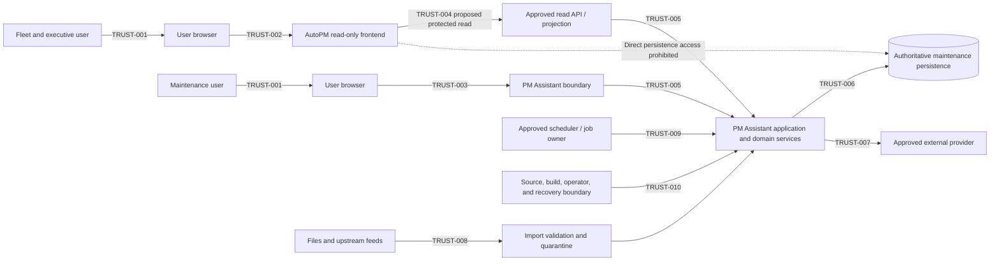

# FleetOS Security Blueprint v1.0

## 1. Purpose

This document defines the security context and target outcomes for FleetOS, AutoPM, PM Assistant, APIs, data, frontend, backend, infrastructure, integrations, delivery, and operations.

It is implementation-oriented but mechanism-neutral. It does not select an identity provider, authentication protocol, token or session format, encryption algorithm, key provider, security vendor, hosting provider, scanner, monitoring product, network topology, or incident service level.

## 2. Scope

### In scope

- Current repository security evidence and gaps.
- Transitional security direction.
- FleetOS v1.0 security domains, assets, actors, trust boundaries, and controls.
- Human and service identity direction.
- Authorization and data-access direction.
- Application, API, browser, backend, integration, infrastructure, delivery, and operational security.
- Threat, audit, monitoring, incident, testing, rollout, and rollback direction.

### Out of scope

- Implementing authentication, authorization, sessions, encryption, secrets, security tooling, configuration, infrastructure, or source changes.
- Selecting vendors, protocols, algorithms, roles, permission names, numeric limits, retention periods, incident targets, or compliance certifications.
- Merging AutoPM and PM Assistant or requiring microservices or a FleetOS platform shell.
- Changing authoritative ownership, identifiers, status semantics, database structures, routes, deployment, or external services.

## 3. Security principles

1. Security claims require direct implementation and validation evidence.
2. Deny access by default at approved protected boundaries.
3. Apply least privilege to humans, services, data, files, networks, environments, builds, logs, and recovery assets.
4. Authenticate before protected access and authorize every protected operation and projection.
5. Enforce security at server and service boundaries; UI visibility is not enforcement.
6. Minimize collection, processing, exposure, logging, export, and retention.
7. Treat browsers, imports, external providers, caches, headers, URLs, and client calculations as untrusted.
8. Preserve PM Assistant authority and AutoPM read-only behavior.
9. Prohibit direct shared-database access.
10. Preserve audit evidence without recording secrets or unnecessary sensitive values.
11. Design controls for failure, compromise, recovery, independent rollback, and safe degradation.
12. Keep architecture-affecting decisions explicit through `SDEC-*` and future ADR approval where required.

## 4. Four-state security architecture

### Current security implementation evidence

Repository evidence shows:

- no proven production authentication, session, or authorization enforcement at current application routes;
- a local user record and visible administrator labels without evidence that they establish an authenticated identity;
- current read, mutation, settings, import, notification, scheduler, diagnostic, log, and system routes without an evidenced authorization dependency;
- permissive development CORS;
- credential and provider settings handled through current PM Assistant settings and persistence;
- webhook signature verification when a secret is configured, with a development bypass when it is absent;
- browser caches and source configuration stored in AutoPM `localStorage`;
- dynamic frontend HTML rendering with escaping in some paths but no proven comprehensive output-encoding or CSP control;
- current CSV/XLSX imports, temporary preview artifacts, diagnostics, local logs, and snapshots without an approved lifecycle or security policy;
- local SQLite persistence and in-process scheduling;
- external notification calls with bounded request timeouts;
- `.env.example` placeholders and ignore rules for `.env`, the local database name, and log directories;
- lower-bound dependency declarations without proven lockfile, scanning, artifact integrity, CI/CD, centralized monitoring, backup restoration, or incident capability.

Current route reachability and production exposure are not established by repository evidence. Existing behavior must not be described as anonymously reachable production behavior without deployment evidence.

### Transitional security direction

Transition should:

1. inventory routes, data fields, settings, credentials, files, jobs, providers, logs, diagnostics, environments, and readers/writers;
2. classify assets and sensitive fields before exposing new read models;
3. identify protected versus deliberately public boundaries;
4. isolate or disable unsafe diagnostics and secret-return behavior before production exposure;
5. introduce approved identity and authorization seams without transferring authority;
6. keep AutoPM legacy reads labeled, bounded, and reversible;
7. add projection, redaction, validation, upload, webhook, job, and logging tests;
8. validate in isolated environments before controlled promotion;
9. retain rollback without restoring compromised credentials or unsafe exposure.

Transition is not permission to expose a partially secured route or to use client-only restrictions as an interim security boundary.

### FleetOS v1.0 target security architecture

FleetOS v1.0 requires:

- approved human and service identity boundaries;
- authenticated protected access;
- default-deny, least-privilege authorization at operation, resource, and projection levels;
- safe credential and session lifecycle;
- classified, minimized, protected, and retained data;
- secure browser, frontend, API, backend, import, webhook, notification, and job boundaries;
- approved environment, network, secret, configuration, dependency, build, logging, monitoring, backup, and recovery controls;
- traceable security events and protected audit evidence;
- tested incident, credential-compromise, rollout, and rollback procedures;
- accepted security validation evidence.

### Future capabilities outside v1.0

- enterprise-wide identity federation beyond approved FleetOS access;
- operational multi-tenant security;
- dedicated security operations center requirements;
- advanced behavioral analytics or automated response;
- mandatory zero-trust product or service mesh;
- multi-region security orchestration;
- public partner APIs or general cross-module commands;
- formal compliance certification;
- mandatory vendor-specific security platforms.

Each future capability requires separate business, privacy, architecture, operational, and rollback approval.

## 5. Security domain registry

| ID | Domain | Scope |
| --- | --- | --- |
| `SECDOM-001` | Governance and assurance | Security decisions, evidence, exceptions, testing, rollout, rollback, and Product Owner gates. |
| `SECDOM-002` | Identity, authentication, and session | Human/service identity, credentials, authentication, sessions, revocation, and compromise. |
| `SECDOM-003` | Authorization and access control | Roles, permissions, least privilege, default deny, operation/resource/field access, and review. |
| `SECDOM-004` | Data protection and privacy | Classification, minimization, encryption direction, retention, deletion, backup, and privacy. |
| `SECDOM-005` | Frontend and browser security | Protected navigation, browser storage, XSS, CSP, safe rendering, and client trust limitations. |
| `SECDOM-006` | Application, API, backend, and integration security | Validation, CORS, CSRF, abuse, errors, transactions, imports, webhooks, notifications, and jobs. |
| `SECDOM-007` | Infrastructure, secrets, configuration, and supply chain | Secret delivery, environments, networks, dependencies, artifacts, configuration, and delivery. |
| `SECDOM-008` | Threat, audit, monitoring, incident, and recovery | Threat model, security events, monitoring, vulnerability handling, incidents, and security recovery. |

## 6. Asset registry

| ID | Asset | Owner or authority direction | Protection concern |
| --- | --- | --- | --- |
| `ASSET-001` | Authoritative maintenance state | PM Assistant | Integrity, availability, authorization, transaction safety, recovery. |
| `ASSET-002` | Maintenance history and domain audit | PM Assistant | Integrity, restricted access, correction evidence, retention. |
| `ASSET-003` | User, responsibility, and identity evidence | Identity authority unresolved; maintenance assignment direction remains gated | Privacy, impersonation, lifecycle, mapping integrity. |
| `ASSET-004` | Vehicle, location, and organizational information | Ownership follows existing data and identity contracts | Accuracy, ambiguity, privacy, controlled projection. |
| `ASSET-005` | Credentials, secrets, and service identity material | Approved identity/secret owners unresolved | Confidentiality, issuance, use, rotation, revocation. |
| `ASSET-006` | APIs and purpose-built read projections | PM Assistant publishes; AutoPM consumes read-only | Authentication, authorization, compatibility, minimization, availability. |
| `ASSET-007` | Frontend state and browser cache | Owning frontend; presentation only | XSS, tampering, leakage, freshness, non-authority. |
| `ASSET-008` | Import files and upstream-source evidence | Controlled PM Assistant ingestion; upstream owners unresolved | Validation, provenance, quarantine, sensitive content, replay. |
| `ASSET-009` | Notification targets, content, and provider evidence | PM Assistant | Recipient authorization, confidentiality, duplication, redaction. |
| `ASSET-010` | Runtime configuration, dependencies, and build artifacts | Approved operator/delivery boundary | Tampering, environment mixing, secret baking, provenance. |
| `ASSET-011` | Logs, diagnostics, monitoring, and security events | Approved operational/security owners unresolved | Redaction, access, integrity, retention, disclosure. |
| `ASSET-012` | Backups, recovery artifacts, and reconciliation evidence | PM Assistant/approved recovery owner | Encryption direction, access, integrity, isolation, deletion, restore safety. |

## 7. Actors and threat agents

### Legitimate actor direction

- Fleet and executive users consume approved AutoPM read views.
- Maintenance users operate authoritative PM Assistant workflows.
- Approved administrators manage only the configuration and access granted to them.
- Approved auditors or reviewers inspect restricted evidence without operational mutation.
- Service identities perform only explicitly approved application, integration, job, or delivery responsibilities.
- Product Owner and approved operators retain decision authority for security architecture, protected rollout, credential action, and incident recovery.

No current visible label proves that a person occupies one of these roles.

### Threat-agent direction

- unauthenticated external actor;
- malicious, compromised, or over-privileged authenticated actor;
- accidental authorized misuse;
- compromised browser or user endpoint;
- compromised service, scheduler, provider, or credential;
- malicious import or upstream input;
- compromised dependency, build input, or artifact;
- unsafe configuration or operator action;
- infrastructure, storage, provider, or availability failure that produces security impact.

## 8. Trust-boundary registry

| ID | Boundary | Required direction |
| --- | --- | --- |
| `TRUST-001` | Human user to browser | Establish user intent and approved identity; protect credentials and sensitive display. |
| `TRUST-002` | Browser to AutoPM | Treat browser and network input as untrusted; protect read projections and cache behavior. |
| `TRUST-003` | Browser to PM Assistant | Authenticate and authorize protected reads and commands; validate requests and sessions. |
| `TRUST-004` | AutoPM to PM Assistant read boundary | Authenticate the approved caller topology, authorize read-only projections, and prohibit privileged browser secrets. |
| `TRUST-005` | PM Assistant boundary to application/domain services | Carry validated identity/access context; enforce owned use cases and invariants. |
| `TRUST-006` | PM Assistant services to authoritative persistence | Restrict credentials and repository access; preserve transaction, audit, and ownership boundaries. |
| `TRUST-007` | PM Assistant to external provider | Protect credentials, targets, payloads, timeouts, provider responses, and replay/duplicate behavior. |
| `TRUST-008` | Upload/feed to import and quarantine boundary | Validate type, size, structure, encoding, provenance, replay, and sensitive content before mutation. |
| `TRUST-009` | Scheduler/background execution to application services | Establish service authority, occurrence identity, single execution, bounded retry, and evidence. |
| `TRUST-010` | Source/build/operator boundary to runtime, secrets, artifacts, logs, and recovery | Separate environments and duties; protect delivery, configuration, evidence, and recovery access. |

## 9. Security context and trust boundaries

This is a logical target model. It does not claim deployed authentication, authorization, proxying, separate processes, networks, or infrastructure.

## 10. Security control registry

| ID | Control direction | Primary domains |
| --- | --- | --- |
| `CTRL-001` | Maintain explicit current, transitional, v1 target, and future states. | `SECDOM-001` |
| `CTRL-002` | Require Product Owner approval and future ADR coverage for material trust or architecture decisions. | `SECDOM-001` |
| `CTRL-003` | Inventory and classify assets, boundaries, identities, readers, writers, and external dependencies. | `SECDOM-001`, `SECDOM-004` |
| `CTRL-004` | Authenticate protected human and service access using an approved mechanism. | `SECDOM-002` |
| `CTRL-005` | Manage credential and session lifecycle, revocation, and compromise safely. | `SECDOM-002` |
| `CTRL-006` | Enforce default-deny, least-privilege authorization at server/service boundaries. | `SECDOM-003` |
| `CTRL-007` | Authorize operations, resources, and fields separately where required. | `SECDOM-003` |
| `CTRL-008` | Preserve separation of duties and review privileged access. | `SECDOM-003`, `SECDOM-008` |
| `CTRL-009` | Classify and minimize data collection, processing, exposure, and retention. | `SECDOM-004` |
| `CTRL-010` | Protect sensitive fields in storage, transport, projections, logs, exports, backups, and deletion flows. | `SECDOM-004` |
| `CTRL-011` | Preserve protected history and audit evidence with defined access, integrity, correction, and retention direction. | `SECDOM-004`, `SECDOM-008` |
| `CTRL-012` | Treat browser state as untrusted, temporary, and non-authoritative. | `SECDOM-005` |
| `CTRL-013` | Prevent XSS through safe rendering, context encoding, validation, and CSP direction. | `SECDOM-005` |
| `CTRL-014` | Keep privileged credentials and sensitive service material out of browser-accessible locations. | `SECDOM-002`, `SECDOM-005` |
| `CTRL-015` | Restrict production CORS and apply CSRF controls appropriate to the approved session topology. | `SECDOM-005`, `SECDOM-006` |
| `CTRL-016` | Validate untrusted input and safely encode output at every boundary. | `SECDOM-005`, `SECDOM-006` |
| `CTRL-017` | Protect APIs with authentication, authorization, bounded work, abuse controls, and safe errors. | `SECDOM-006` |
| `CTRL-018` | Protect state changes and external effects against replay and duplicate outcomes. | `SECDOM-006` |
| `CTRL-019` | Enforce backend application, domain, repository, transaction, and audit boundaries. | `SECDOM-006` |
| `CTRL-020` | Secure imports and uploads through type, size, structure, provenance, quarantine, cleanup, and replay controls. | `SECDOM-006` |
| `CTRL-021` | Verify and constrain webhooks, notifications, providers, and recipient behavior. | `SECDOM-006` |
| `CTRL-022` | Secure background jobs through service authority, deterministic occurrence, single execution, bounded recovery, and audit. | `SECDOM-006` |
| `CTRL-023` | Store and deliver secrets only through an approved non-source, non-public boundary. | `SECDOM-007` |
| `CTRL-024` | Validate configuration safely and isolate environment data, credentials, recipients, and authority. | `SECDOM-007` |
| `CTRL-025` | Restrict network and persistence access to approved flows; AutoPM receives no database path. | `SECDOM-007` |
| `CTRL-026` | Inventory, review, constrain, scan, and remediate dependencies and supply-chain inputs. | `SECDOM-007` |
| `CTRL-027` | Produce identifiable, traceable, integrity-verified artifacts without baked-in secrets. | `SECDOM-007` |
| `CTRL-028` | Use minimized, structured, redacted, access-controlled operational logging. | `SECDOM-007`, `SECDOM-008` |
| `CTRL-029` | Detect and monitor security-relevant events without collecting prohibited content. | `SECDOM-008` |
| `CTRL-030` | Maintain an approved threat model, vulnerability process, incident process, and credential-compromise procedure. | `SECDOM-008` |
| `CTRL-031` | Validate security through static, dependency, dynamic, misuse, access, recovery, and human review. | `SECDOM-001`, `SECDOM-008` |
| `CTRL-032` | Roll out and roll back security changes without transferring authority, losing evidence, or restoring compromised material. | `SECDOM-001`, `SECDOM-008` |

## 11. Module and status security boundaries

### AutoPM

AutoPM may receive only approved read projections under `CTRL-006`, `CTRL-007`, and `CTRL-017`. It must not receive:

- a PM Assistant database credential;
- maintenance command authority;
- privileged provider credentials;
- unrestricted settings, diagnostics, notification targets, raw imports, or audit contents;
- permission implied by a visible navigation item.

### PM Assistant

PM Assistant:

- remains authoritative for maintenance workflow information;
- enforces protected command and read decisions at owned boundaries;
- protects persistence, history, imports, notifications, jobs, settings, diagnostics, and audit;
- remains independently operable when AutoPM is unavailable.

### Status concepts

Security policy must not collapse or infer access from one status domain to another:

| Status | Security interpretation |
| --- | --- |
| `pm_mileage_status` | Protected maintenance condition derived only after accepted mileage and rule decisions. |
| `pm_workflow_status` | Protected authoritative workflow progression. |
| `completion_status` | Protected explicit completion/correction/reopen evidence. |
| `notification_status` | Protected notification intent and delivery result. |

Notification success never proves maintenance completion, and UI presentation never authorizes a status mutation.

## 12. Architecture and operational impact

The Blueprint adds security requirements and future implementation gates but changes no runtime architecture. A later implementation may introduce identity adapters, authorization policies, safer projections, configuration boundaries, structured evidence, and protected operational controls within current technologies.

It does not require:

- a merged FleetOS application;
- a platform shell;
- one service per logical responsibility;
- microservices;
- a particular proxy, cloud, database, identity, secret, scanning, or monitoring product.

Material changes to caller topology, trust termination, persistence access, identity authority, service boundaries, or external exposure require `SDEC-*` resolution and may require a future ADR.

## 13. Risks and security rollback

| Risk | Direction |
| --- | --- |
| Target control is mistaken for current enforcement | Use `CTRL-001`; require runtime evidence before operational claims. |
| Visible user or role labels become accidental identity policy | Apply `CTRL-004` through `CTRL-008`; keep `SDEC-*` unresolved. |
| AutoPM gains write or persistence access | Enforce module boundaries and `CTRL-025`; stop rollout. |
| Sensitive current diagnostics are promoted into v1 | Use purpose-built projections, `CTRL-009`, `CTRL-010`, and `CTRL-028`. |
| Security mechanism is selected without architecture approval | Record the decision under `SDEC-*`; require `CTRL-002`. |
| Security rollback restores an exposed credential or weakness | Revoke/rotate; use a known-safe forward fix or rollback that does not reopen the issue. |
| Audit is deleted to conceal or simplify recovery | Preserve safe evidence under `CTRL-011`, `CTRL-030`, and `CTRL-032`. |

For this documentation-only phase, rollback is an isolated Product Owner revert of the nine files under `docs/security/`. No application, data, configuration, secret, deployment, or external-service rollback is required.

## 14. Definition of Security Blueprint complete

The Security Blueprint is complete when:

1. all nine approved documents exist and link correctly;
2. all security-local identifiers are unique, contiguous, defined once, and correctly cross-referenced;
3. all required security content is covered;
4. current evidence, transition, v1 target, and future capability remain distinct;
5. FleetOS, module, ownership, identity, and status guardrails are preserved;
6. unresolved mechanism and architecture decisions remain explicit `SDEC-*` items;
7. Mermaid diagrams remain conceptual;
8. Markdown, links, terminology, identifiers, operational claims, and secret safety pass validation;
9. no existing file, source, data, configuration, environment, deployment, or external service is changed;
10. exact changed files, validation limitations, risks, and remaining decisions are reported;
11. the work stops before commit.

Blueprint completion is documentation completion only. It is not security implementation, acceptance, production readiness, deployment, certification, or FleetOS v1.0 release.
