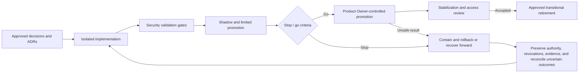

# FleetOS Security Validation and Rollout

## Purpose and status

This document defines validation gates, security testing direction, access review, staged rollout, rollback, unresolved Product Owner decisions, and the definition of FleetOS Security Blueprint complete.

It authorizes no implementation, scan against an external environment, production test, deployment, migration, credential action, infrastructure change, notification, restore, or external-service action.

## State interpretation

- **Current security implementation evidence:** the repository does not demonstrate an established automated security test suite, dependency scanner, dynamic test program, access-review process, incident rehearsal, or CI security gate.
- **Transitional security direction:** Phase 4.7 validates documentation locally and defines later isolated implementation gates without claiming runtime enforcement.
- **FleetOS v1.0 target security architecture:** all applicable `SVAL-*` gates pass after approved mechanisms are implemented and tested.
- **Future capabilities outside v1.0:** continuous security automation, enterprise scanning platforms, regulated certification, and advanced response remain optional and separately approved.

## Validation principles

1. Documentation is not runtime evidence.
2. A control passes only when its selected mechanism and protected boundary are tested.
3. Identity, authorization, data, application, infrastructure, operations, and recovery are separate gates.
4. Current evidence, transitional direction, v1 target, and future capability remain distinct.
5. Failed or unavailable tooling is reported as a limitation, not a pass.
6. Security tests use isolated approved environments, synthetic or approved sanitized data, and safe credentials supplied outside the repository.
7. Tests do not echo credentials, targets, raw payloads, personal data, private endpoints, or sensitive environment values.
8. Security rollout preserves PM Assistant authority, AutoPM read-only behavior, and independent rollback.
9. Rollback never restores compromised or revoked material.
10. Product Owner approval is required for architecture decisions, implementation scope, protected rollout, external action, accepted exceptions, and release.

## Validation gate registry

| ID | Gate | Required evidence |
| --- | --- | --- |
| `SVAL-001` | Documentation structure and scope | Exactly nine approved files; no existing file changes; required sections and state model present. |
| `SVAL-002` | Links and Mermaid | Local links resolve; code fences close; conceptual diagrams parse or receive documented manual review. |
| `SVAL-003` | Identifier integrity | Every security-local identifier is unique, contiguous, defined once, and correctly cross-referenced. |
| `SVAL-004` | Terminology and architecture | FleetOS parent identity, bounded modules, ownership, API, status, and identifier guardrails match governing documents. |
| `SVAL-005` | Operational claims and secret safety | Proposed controls are not called operational; secret/sensitive patterns and examples are safe. |
| `SVAL-006` | Trust, asset, and threat coverage | `ASSET-*`, `TRUST-*`, `THREAT-*`, actors, controls, and failure paths cover the approved scope. |
| `SVAL-007` | Identity, authentication, credential, and session | `IDENT-*` normal, absent, malformed, expired, revoked, compromise, lifecycle, and rollback cases pass after implementation. |
| `SVAL-008` | Authorization and access control | `ACCESS-*` default-deny, least-privilege, operation, resource, field, navigation, service, revocation, and review cases pass. |
| `SVAL-009` | Data protection and privacy | Classification, minimization, redaction, encryption direction, retention, deletion, backup, audit, privacy, and non-production data tests pass. |
| `SVAL-010` | Frontend and browser | Browser storage, protected navigation, XSS, safe rendering, CSP, unauthorized/stale/unavailable states, and sensitive display tests pass. |
| `SVAL-011` | API and abuse protection | Authentication, authorization, CORS, CSRF, validation, output encoding, errors, rate, cache, replay, enumeration, timeout, and bounded-work tests pass. |
| `SVAL-012` | Backend, repository, and transaction | Application/domain/repository boundaries, expected state, required audit, uncertain commit, no hidden write, and AutoPM no-persistence tests pass. |
| `SVAL-013` | Import, webhook, notification, and jobs | File limits, parser failure, quarantine, replay, webhook verification, recipient access, duplicate outcomes, job single execution, and recovery tests pass. |
| `SVAL-014` | Secrets, configuration, environment, and network | No secret leakage, safe validation, isolation, least privilege, approved flows, persistence restriction, and rollback tests pass. |
| `SVAL-015` | Supply chain and artifact integrity | Dependency inventory, static/dependency findings, version/provenance, artifact contents, integrity, secret scan, and exception tests pass. |
| `SVAL-016` | Events, monitoring, audit, incident, and vulnerability | `SECEVT-*`, redaction, protected access, alert flow, incident rehearsal, credential compromise, vulnerability disposition, and evidence tests pass. |
| `SVAL-017` | Rollout, rollback, backup, and recovery | Staged enablement, stop/go, revocation preservation, job/provider reconciliation, isolated restore, and safe rollback rehearsal pass. |
| `SVAL-018` | Product Owner completion | Required decisions and ADRs are accepted, evidence and limitations are reviewed, exceptions are owned, and Product Owner records approval. |

## Documentation validation procedure

For this Phase 4.7 documentation change:

1. Confirm branch `phase-4-7-security-blueprint`.
2. Confirm no pre-existing working-tree changes.
3. Confirm only the nine approved `docs/security/` files are added.
4. Validate Markdown headings, tables, lists, code fences, and whitespace.
5. Validate local relative links and anchors where referenced.
6. Inspect Mermaid syntax and ensure diagrams say or imply conceptual target direction only.
7. Extract all security-local identifiers.
8. Confirm definitions are unique and ranges are contiguous.
9. Confirm every reference resolves to a defined identifier.
10. Search for FleetOS, AutoPM, PM Assistant, ownership, identity, and status terminology.
11. Confirm `vehicle_no` is transitional and `fleetos_vehicle_id` is proposed/unimplemented.
12. Confirm all four status concepts remain separate.
13. Search for unsupported words such as operational, deployed, enforced, implemented, certified, and compliant and review each use in context.
14. Run a safe secret-pattern scan without printing suspected values.
15. Run `git diff --check`, changed-file review, and final working-tree inspection.
16. Report passes, warnings, not-run checks, tooling limitations, and remaining decisions.

## Future security testing strategy

### Static security testing

Static testing should cover:

- Python, JavaScript, HTML, CSS, Apps Script, templates, and configuration;
- hard-coded credentials and sensitive endpoints;
- unsafe dynamic HTML and output contexts;
- missing authorization calls;
- unsafe deserialization, file, path, command, SQL, or request behavior;
- broad exception and diagnostic leakage;
- dependency and import usage;
- security header and CORS configuration;
- dead or legacy routes that bypass target policy.

No static-analysis tool is selected. Findings require human validation.

### Dependency and supply-chain scanning

Dependency validation should cover:

- direct and transitive inventory;
- selected version constraints and reproducibility;
- known vulnerability and malicious-package signals from approved sources;
- provenance and integrity where available;
- license and maintenance direction;
- unused or excessive privilege;
- upgrade compatibility;
- artifact and build-input contents;
- exceptions, owners, and re-review.

No scanner, vulnerability database, severity threshold, SBOM format, or remediation deadline is approved.

### Dynamic testing direction

Dynamic testing in an isolated approved environment should cover:

- absent, malformed, expired, revoked, and insufficient identity;
- operation, resource, field, and navigation authorization;
- direct URL and API access;
- CORS preflight and cross-origin failures;
- CSRF behavior appropriate to the selected session design;
- XSS and output-encoding cases;
- input, Unicode, date, filter, cursor, header, body, and timeout limits;
- rate and automated-abuse behavior;
- error and resource-existence disclosure;
- cache isolation and stale data;
- upload size, parser, workbook, temporary-file, and cleanup behavior;
- webhook signature, replay, duplicate, malformed, and oversized input;
- notification recipient, payload, retry, ambiguous result, and redaction;
- scheduler overlap, restart, retry, uncertain work, and duplicate prevention;
- diagnostic, log, snapshot, settings, export, and audit access;
- dependency, provider, persistence, and monitoring failure.

Production dynamic testing requires separate explicit authorization and scope.

## Registry cross-reference map

This map ensures registry entries are used outside their defining rows and gives later implementation reviews a minimum traceability route.

- Governance and boundary inventory applies `CTRL-003` through `SVAL-004`, `SVAL-005`, and `SVAL-006`.
- Identity lifecycle validation applies `IDENT-002`, `IDENT-003`, `IDENT-004`, `IDENT-005`, `IDENT-006`, `IDENT-007`, `IDENT-011`, `IDENT-012`, `IDENT-014`, and `IDENT-015` through `SVAL-007`.
- Least-privilege validation applies `ACCESS-002`, `ACCESS-003`, `ACCESS-004`, `ACCESS-005`, `ACCESS-011`, `ACCESS-013`, `ACCESS-014`, and `ACCESS-016` through `SVAL-008`.
- Data-protection validation applies `DPROT-002`, `DPROT-004`, `DPROT-010`, `DPROT-011`, and `DPROT-015` through `SVAL-009`.
- API and backend threat validation applies `THREAT-002`, `THREAT-003`, `THREAT-005`, `THREAT-006`, `THREAT-008`, `THREAT-009`, `THREAT-010`, `THREAT-011`, and `THREAT-012` through `SVAL-010`, `SVAL-011`, `SVAL-012`, and `SVAL-013`.
- Security evidence validation applies `SECEVT-005`, `SECEVT-006`, `SECEVT-007`, `SECEVT-008`, `SECEVT-009`, `SECEVT-011`, `SECEVT-012`, and `SECEVT-013` through `SVAL-014`, `SVAL-015`, and `SVAL-016`.
- Documentation and architecture validation applies `SVAL-002`, `SVAL-003`, `SVAL-004`, `SVAL-005`, and `SVAL-006` before any later runtime gate.
- API and repository assurance requires `SVAL-011` and `SVAL-012` before controlled promotion.

### Misuse and threat-driven testing

Each `THREAT-*` receives:

- preventive-control test;
- detection/security-event test;
- safe failure test;
- incident/containment direction;
- rollback or forward-recovery test;
- residual-risk review.

Threat testing must not use real credentials, recipients, private endpoints, or production data in ordinary fixtures.

### Access review testing

Under `ACCESS-017`, review evidence should detect:

- inactive or terminated human access;
- orphaned or shared identities;
- over-privileged roles or service identities;
- cross-environment permission;
- expired temporary access;
- unused privileged access;
- unreviewed provider, backup, build, or recovery authority;
- UI access inconsistent with server policy;
- access that conflicts with separation of duties.

Cadence, owners, evidence retention, and exception thresholds remain `SDEC-021`.

### Backup, recovery, and incident testing

Rehearsals should validate:

- access to protected runbooks and tools;
- credential compromise and revocation;
- isolated backup restoration;
- application and security-policy compatibility;
- authoritative data, identifiers, four statuses, history, audit, and security-event reconciliation;
- uncertain jobs, imports, webhooks, notifications, and commands;
- safe re-enablement;
- measured outcomes against future approved objectives;
- post-recovery monitoring and review.

## Security rollout strategy

### Stage 0 — Decision and evidence baseline

- Accept or revise governing architecture, ownership, identity, API, data, application, infrastructure, and security direction.
- Resolve required `SDEC-*` items and future ADRs.
- Inventory routes, assets, fields, credentials, environments, readers, writers, providers, jobs, logs, and recovery paths.

Exit: no unresolved decision blocks safe isolated implementation.

### Stage 1 — Identity and protected boundary

- Implement the approved identity/authentication topology in isolated environments.
- Establish safe principal context, credential/session lifecycle, and security events.
- Protect privileged current routes before broad target integration.

Exit: `SVAL-007` passes for the approved scope.

### Stage 2 — Authorization and data projection

- Apply default deny and least privilege.
- Implement operation, resource, field, and navigation policy.
- Introduce safe projections, redaction, and restricted diagnostics.

Exit: `SVAL-008` and `SVAL-009` pass.

### Stage 3 — Application, API, and integration controls

- Restrict CORS and implement applicable CSRF, XSS, CSP, validation, rate, replay, and error controls.
- Secure imports, webhooks, notifications, repositories, transactions, and jobs.
- Keep AutoPM read-only and behind the approved read topology.

Exit: `SVAL-010` through `SVAL-013` pass.

### Stage 4 — Infrastructure and supply chain

- Implement approved secret/configuration, environment, network, dependency, artifact, logging, backup, and recovery controls.
- Validate no credential or environment leakage.

Exit: `SVAL-014`, `SVAL-015`, and applicable recovery evidence pass.

### Stage 5 — Monitoring, incident, and shadow validation

- Produce `SECEVT-*` evidence.
- Validate monitoring, alert ownership, vulnerability handling, incident, and credential compromise.
- Shadow target read behavior and compare security, data, status, freshness, and error outcomes without mutation.

Exit: `SVAL-016` passes and shadow differences have approved dispositions.

### Stage 6 — Limited controlled promotion

- Enable the protected target for an approved audience or traffic slice.
- Observe access decisions, sensitive exposure, errors, abuse, jobs, notifications, imports, freshness, and security events.
- Maintain provider compatibility and component rollback.

Exit: approved stop/go and stabilization thresholds pass.

### Stage 7 — Product Owner cutover and stabilization

- Product Owner separately approves production promotion.
- Retain fallback only where it remains safe, compatible, and visibly stale.
- Revoke transitional access and credentials when retired.
- Continue access review and incident readiness.

Exit: `SVAL-017` and `SVAL-018` pass.

### Stage 8 — Transitional retirement

- Retire legacy feeds, routes, settings, diagnostics, credentials, files, and access only through separate approved scope.
- Preserve required authoritative, audit, security, and recovery evidence.

## Security rollout and rollback

The flow is conceptual and does not claim a deployment pipeline or feature-switch implementation.

## Stop and rollback triggers

Stop rollout for:

- authentication bypass or protected anonymous access;
- failed revocation or session termination;
- privilege escalation, broken resource access, or client-only enforcement;
- AutoPM mutation or direct database access;
- credential, session, key, target, payload, personal, diagnostic, or topology disclosure;
- unsafe CORS, CSRF, XSS, CSP, cache, or browser storage;
- unbounded input, upload, rate, retry, or parser work;
- webhook verification bypass;
- duplicate or uncertain commands, jobs, imports, or notifications without safe reconciliation;
- missing required audit/security evidence;
- environment or recipient cross-contamination;
- compromised dependency or artifact;
- failed backup restore, recovery, or rollback rehearsal;
- unsupported claim that a proposed control is operational;
- absence of accountable owner or credible containment.

## Rollback direction

### AutoPM

- Disable the affected target read path through the approved reversible control.
- Restore only a safe compatible read path.
- Display source and staleness.
- Never write cache or legacy data to PM Assistant.
- Remove invalid cached access-sensitive state as required.

### PM Assistant and API

- Disable unsafe exposure or privileged operations.
- Preserve compatible provider behavior where safe.
- Preserve accepted maintenance state, identifiers, history, audit, and security events.
- Do not broaden anonymous or administrator access to recover compatibility.

### Identity and credentials

- Terminate affected sessions.
- Revoke or rotate affected credentials.
- Keep current revocation state during application/configuration rollback.
- Never restore compromised material.

### Jobs, imports, webhooks, and notifications

- Stop unsafe acquisition or delivery.
- Preserve occurrence, batch, event, intent, and attempt evidence.
- Reconcile uncertain outcomes before retry.
- Prevent simultaneous old and new execution owners.

### Data and persistence

- Stop unsafe writes when required.
- Use approved restore, forward recovery, compensating correction, mapping/rule rollback, or controlled replay.
- Never transfer authority to AutoPM, browser cache, Google Sheets, CSV, or the latest timestamp.

### Security tooling and configuration

- Restore a known-safe compatible version only if it does not reopen the weakness.
- Preserve security evidence.
- Report unavailable monitoring or scanning as residual risk.

## Unresolved Product Owner decision registry

All items remain unresolved. This Blueprint records direction but does not select answers.

| ID | Unresolved decision | Blocks or affects |
| --- | --- | --- |
| `SDEC-001` | Human identity authority, source, uniqueness, and enterprise mapping. | Protected human access and identity migration. |
| `SDEC-002` | Provisioning, approval, suspension, termination, reactivation, propagation, and identity-evidence retention. | Identity lifecycle and access revocation. |
| `SDEC-003` | Human authentication mechanism, credential type, recovery, MFA/password direction if applicable, and failure behavior. | Production human authentication. |
| `SDEC-004` | Session topology, storage, binding, renewal, inactivity/absolute lifetime, logout, revocation, concurrency, and reauthentication. | Browser and protected session security. |
| `SDEC-005` | Authorization policy model, default-deny implementation, unavailable-policy behavior, and policy administration. | All protected operations and reads. |
| `SDEC-006` | Role vocabulary, permission matrix, resource/field rules, separation of duties, temporary/emergency access, and disclosure policy. | Least privilege and protected administration. |
| `SDEC-007` | Browser-direct versus trusted AutoPM proxy topology, trust termination, and caller identity. | AutoPM API authentication, CORS, browser-secret safety, caching. |
| `SDEC-008` | Service identities for AutoPM, jobs, providers, imports, build, deployment, monitoring, backup, and recovery. | Non-human access and secret scope. |
| `SDEC-009` | Browser storage, cache lifetime, access-sensitive invalidation, offline behavior, and stale/fallback limits. | AutoPM and PM Assistant frontend data safety. |
| `SDEC-010` | Secret/configuration storage, delivery, write-only settings UX, precedence, reload, rotation, revocation, and break-glass process. | Credentials, runtime, providers, operations. |
| `SDEC-011` | Production origin policy, CORS values, CSRF design, trusted proxy behavior, and state-changing browser request protection. | Web and API exposure. |
| `SDEC-012` | Content Security Policy directives, rollout/reporting, legacy inline compatibility, frames, and external resources. | Frontend XSS defense and hosting. |
| `SDEC-013` | Rate-limit identity, sustained/burst behavior, route weights, bypass, response metadata, abuse thresholds, and environment differences. | API, diagnostics, imports, and provider protection. |
| `SDEC-014` | Idempotency/replay identities, storage, windows, conflict behavior, and recovery for commands, imports, webhooks, notifications, and jobs. | Duplicate and uncertain outcomes. |
| `SDEC-015` | Encryption-in-transit, encryption-at-rest, key management, certificates, TLS termination, internal transport, and network trust topology. | Data, API, persistence, backup, provider, and operations security. |
| `SDEC-016` | Retention and archival for operational data, logs, audit, security events, imports, notifications, webhooks, diagnostics, exports, temporary files, browser cache, and backups. | Data lifecycle, monitoring, recovery, privacy. |
| `SDEC-017` | Privacy purpose, personal/responsibility data, correction, deletion, anonymization, legal hold, external copies, and request handling. | Privacy and historical evidence. |
| `SDEC-018` | LINE/provider credentials, webhook verification requirements, recipient authorization, message minimization, retry, idempotency, diagnostics, and retention. | Notification and webhook production use. |
| `SDEC-019` | Environment, hosting, runtime, network, operator access, diagnostics, logging, backup, restore, and recovery topology. | Production infrastructure and operational security. |
| `SDEC-020` | Dependency constraints, lock/reproducibility, scanning tools, vulnerability classification/remediation, SBOM, artifact integrity, signing/attestation, and exceptions. | Supply-chain and release assurance. |
| `SDEC-021` | Audit/security-event schemas, access, immutability/correction, retention, access-review cadence, reviewers, exceptions, and evidence. | Audit, compliance direction, and least-privilege review. |
| `SDEC-022` | Monitoring signals, metrics/logs/traces, storage, redaction, alert thresholds, routing, ownership, acknowledgement, escalation, and tuning. | Detection and operational readiness. |
| `SDEC-023` | Incident classifications, severity, authority, communications, evidence, external notification if applicable, response/recovery targets, vulnerability disclosure, and post-incident review. | Incident readiness and accepted risk. |
| `SDEC-024` | Security rollout cohorts, shadow thresholds, stop/go criteria, stabilization period, rollback deadlines, legacy retirement, release evidence, and exception acceptance. | Protected promotion and FleetOS v1.0 release. |

Material resolution of `SDEC-001`, `SDEC-003` through `SDEC-008`, `SDEC-010` through `SDEC-015`, `SDEC-018` through `SDEC-020`, `SDEC-022`, `SDEC-023`, or `SDEC-024` may require a future ADR because it can change trust boundaries or architecture.

## Definition of Security Blueprint complete

Phase 4.7 documentation is complete when:

1. all nine approved files exist under `docs/security/`;
2. no existing file is modified;
3. the 65 required security content areas are covered across the document set;
4. current evidence, transitional direction, FleetOS v1.0 target, and future capability remain distinct;
5. `SECDOM-*`, `ASSET-*`, `TRUST-*`, `THREAT-*`, `CTRL-*`, `IDENT-*`, `ACCESS-*`, `DPROT-*`, `SECEVT-*`, `SVAL-*`, and `SDEC-*` are unique, contiguous, defined once, and cross-referenced;
6. FleetOS remains the parent platform, module boundaries and authority remain intact, and direct shared-database access remains prohibited;
7. all four status concepts remain distinct;
8. `vehicle_no` remains transitional and `fleetos_vehicle_id` remains proposed/unimplemented;
9. no security mechanism, vendor, threshold, retention period, role, algorithm, certification, or SLA is invented;
10. diagrams remain conceptual and proposed controls are not represented as implemented;
11. Markdown, Mermaid, links, terminology, identifiers, boundaries, operational claims, and secret safety pass applicable validation;
12. exact changed files, diff summary, validation, limitations, risks, and unresolved decisions are reported;
13. the work stops before commit.

Security Blueprint completion does not resolve `SDEC-*`, accept future ADRs, implement controls, prove production readiness, authorize deployment, or complete FleetOS v1.0 release.
