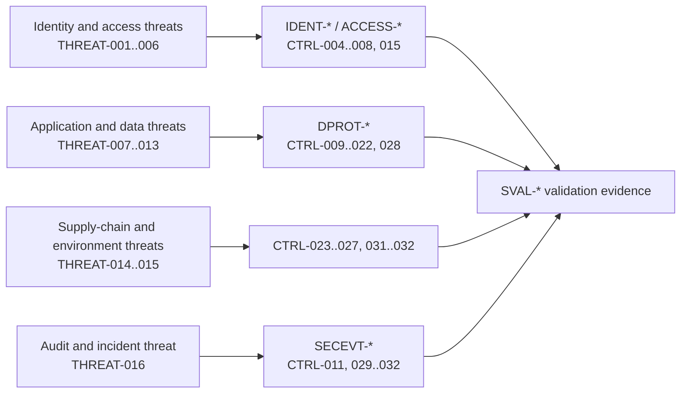
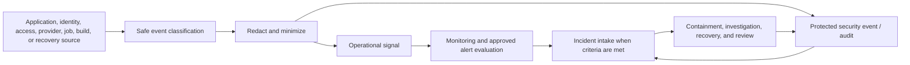
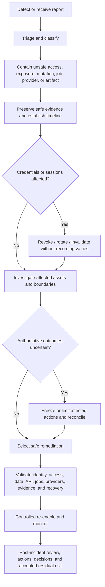

# FleetOS Threat Model, Incident, and Audit

## Purpose and status

This document defines the FleetOS v1.0 threat model, security-event direction, monitoring, audit, incident classification, incident response, credential compromise, and vulnerability management.

It does not claim an operational monitoring or incident capability and does not select a security vendor, severity scoring system, alert threshold, response SLA, forensic tool, disclosure process, or communications platform.

## Threat-model scope

The model covers:

- `ASSET-001` through `ASSET-012`;
- `TRUST-001` through `TRUST-010`;
- human, service, provider, import, browser, application, persistence, build, operator, and recovery actors;
- confidentiality, integrity, availability, authenticity, authorization, privacy, audit, and recoverability;
- current evidence, transition, v1 target, and future capability separately.

Threat modeling does not prove that a vulnerability is exploitable or that a control is implemented. It establishes review and validation obligations.

## Current security implementation evidence

- Current routes and screens include credential/settings, maintenance mutation, import, notification, scheduler, diagnostic, log, API testing, and snapshot capabilities without proven authorization.
- Current diagnostics and persistence can contain credential-derived, target, message, webhook, import, provider, path, and runtime information.
- Current webhook signature verification is conditional on configured secret material.
- Current frontends use browser cache and dynamic HTML.
- Current uploads and in-process scheduling lack proven production limits and duplicate-execution controls.
- No established security-event pipeline, alerting, access review, vulnerability workflow, incident runbook, or operational owner is demonstrated.
- Existing documentation defines target observability, audit, recovery, and security direction.

This evidence informs threats but is not a claim about deployed exposure or an active incident.

## FleetOS v1.0 target security architecture

## Threat-agent direction

| Threat agent | Capability direction |
| --- | --- |
| External unauthenticated actor | Sends requests, malformed input, automated traffic, webhook attempts, or probes exposed by the selected topology. |
| Malicious or compromised authenticated actor | Uses legitimate access beyond purpose, enumerates resources, exports data, changes settings, or conceals activity. |
| Accidental authorized actor | Misconfigures access, recipients, jobs, imports, environments, retention, or recovery. |
| Compromised browser/endpoint | Reads browser-accessible material, alters requests/state, injects content, or reuses sessions. |
| Compromised service/provider | Misuses credentials, sends spoofed/replayed events, leaks payloads, or returns deceptive results. |
| Malicious input/source | Exploits parser, import, Unicode, formula, size, or reconciliation behavior. |
| Supply-chain actor | Alters a dependency, build input, artifact, or update source. |
| Infrastructure/operator failure | Causes unsafe exposure, loss of evidence, cross-environment effects, insecure rollback, or unavailable controls. |

## Threat registry

| ID | Threat | Assets/boundaries | Required control direction |
| --- | --- | --- | --- |
| `THREAT-001` | Unauthorized protected production access | `ASSET-001` through `ASSET-012`; `TRUST-002` through `TRUST-004` | `CTRL-004`, `CTRL-006`, `IDENT-*`, `ACCESS-*` |
| `THREAT-002` | Privilege escalation, broken operation authorization, or broken resource-level access | `ASSET-001`, `ASSET-002`, `ASSET-003`, `ASSET-006`, `ASSET-011`; `TRUST-003` through `TRUST-006` | `CTRL-006` through `CTRL-008`, `ACCESS-009` through `ACCESS-015` |
| `THREAT-003` | AutoPM mutation, duplicated authority, or direct shared-database access | `ASSET-001`, `ASSET-002`, `ASSET-006`; `TRUST-004`, `TRUST-006` | `CTRL-006`, `CTRL-019`, `CTRL-025`, `ACCESS-006`, `ACCESS-007` |
| `THREAT-004` | Credential, secret, key, or recovery-material disclosure | `ASSET-005`, `ASSET-010`, `ASSET-012`; `TRUST-001`, `TRUST-003`, `TRUST-007`, `TRUST-010` | `CTRL-005`, `CTRL-014`, `CTRL-023`, `IDENT-008`, `IDENT-009` |
| `THREAT-005` | Session theft, fixation, replay, cross-environment use, or failed revocation | `ASSET-003`, `ASSET-005`, `ASSET-007`; `TRUST-001` through `TRUST-004` | `CTRL-005`, `IDENT-010` through `IDENT-013` |
| `THREAT-006` | Unsafe CORS, CSRF, or browser-origin trust | `ASSET-006`, `ASSET-007`; `TRUST-002` through `TRUST-004` | `CTRL-015`, `ACCESS-008`, `SDEC-011` |
| `THREAT-007` | XSS, unsafe rendering, or browser-storage disclosure/tampering | `ASSET-006`, `ASSET-007`; `TRUST-001` through `TRUST-003` | `CTRL-012` through `CTRL-014`, `CTRL-016` |
| `THREAT-008` | Injection, malformed input, Unicode ambiguity, or unsafe output interpretation | `ASSET-001`, `ASSET-004`, `ASSET-006`, `ASSET-008`; `TRUST-003`, `TRUST-004`, `TRUST-008` | `CTRL-016`, `CTRL-019`, `DPROT-006` |
| `THREAT-009` | Upload, workbook, parser, temporary-file, or resource-exhaustion attack | `ASSET-008`, `ASSET-010`, `ASSET-011`; `TRUST-008` | `CTRL-017`, `CTRL-020` |
| `THREAT-010` | API enumeration, automated abuse, excessive load, cache confusion, or replay | `ASSET-006`, `ASSET-011`; `TRUST-002` through `TRUST-004` | `CTRL-017`, `CTRL-018`, `ACCESS-010` through `ACCESS-012` |
| `THREAT-011` | Webhook spoofing/replay or notification recipient/payload abuse | `ASSET-005`, `ASSET-009`, `ASSET-011`; `TRUST-007` | `CTRL-018`, `CTRL-021`, `DPROT-016` |
| `THREAT-012` | Duplicate or uncertain scheduler, import, command, or notification outcome | `ASSET-001`, `ASSET-002`, `ASSET-008`, `ASSET-009`; `TRUST-008`, `TRUST-009` | `CTRL-018`, `CTRL-020` through `CTRL-022` |
| `THREAT-013` | Sensitive disclosure through logs, errors, settings, diagnostics, exports, snapshots, or audit | `ASSET-003` through `ASSET-005`, `ASSET-008` through `ASSET-012`; multiple boundaries | `CTRL-009` through `CTRL-011`, `CTRL-028`, `DPROT-003` through `DPROT-005` |
| `THREAT-014` | Dependency, source, build-input, or artifact compromise | `ASSET-010`; `TRUST-010` | `CTRL-026`, `CTRL-027`, `CTRL-031` |
| `THREAT-015` | Environment, network, configuration, backup, or recovery compromise | `ASSET-001`, `ASSET-005`, `ASSET-010`, `ASSET-012`; `TRUST-006`, `TRUST-010` | `CTRL-024`, `CTRL-025`, `CTRL-032`, `DPROT-012`, `DPROT-013` |
| `THREAT-016` | Audit tampering, monitoring gap, delayed containment, or unsafe incident recovery | `ASSET-002`, `ASSET-011`, `ASSET-012`; `TRUST-010` | `CTRL-011`, `CTRL-029` through `CTRL-032`, `DPROT-014` |

## Threat and control mapping

The mapping is conceptual. A documented control is not implemented until runtime evidence passes the applicable `SVAL-*` gate.

## Security-event registry

| ID | Event direction | Minimum safe evidence |
| --- | --- | --- |
| `SECEVT-001` | Identity lifecycle | Safe principal reference, action, authority, result, time, and reason classification. |
| `SECEVT-002` | Authentication | Boundary, principal class if established, result class, safe reason, correlation, environment, and time. |
| `SECEVT-003` | Authorization | Action, safe resource/projection reference, decision, policy/version reference, correlation, and time. |
| `SECEVT-004` | Credential or session lifecycle/compromise | Credential class, owner, action, exposure classification, revocation/rotation disposition, and time; never the value. |
| `SECEVT-005` | Sensitive-data access/export | Purpose, principal, data class, safe scope, result, export reference if applicable, and time. |
| `SECEVT-006` | Security/configuration/access-policy change | Setting or policy name, previous/new safe classification or version, approver/actor, environment, result, and time. |
| `SECEVT-007` | Import/upload/reconciliation | Batch reference, source class, validation counts, exceptions, replay disposition, actor/process, and time. |
| `SECEVT-008` | Webhook/provider/notification | Intent/event/attempt references, verification, recipient class, result, retry disposition, and time without raw secret or payload. |
| `SECEVT-009` | Scheduler/background execution | Job definition, occurrence, attempt, service identity, acquisition, result, duration, and recovery disposition. |
| `SECEVT-010` | Diagnostic/log/audit access | Evidence class, principal, purpose, scope, export/action, result, and time. |
| `SECEVT-011` | Dependency/build/artifact security | Component/artifact reference, version, check, finding classification, approval/exception, and time. |
| `SECEVT-012` | Environment/network/backup/recovery security | Environment, operation, safe component reference, identity, approval, result, and time. |
| `SECEVT-013` | Security alert or incident | Incident reference, detection source, classification, affected assets, status, decisions, owner, and safe timeline. |
| `SECEVT-014` | Vulnerability and remediation | Finding reference, affected component/control, exposure, disposition, validation, exception/review, and time. |

## Security-event and audit flow

Operational logs, domain audit, and security events may share correlation but retain distinct purpose, access, integrity, and retention policies.

## Logging, monitoring, and alert direction

Monitoring should make visible:

- authentication and authorization failures;
- privileged or sensitive access;
- credential and policy lifecycle;
- unexpected origin, CSRF, input, upload, rate, replay, and resource-access failures;
- webhook verification and provider failures;
- import exceptions and duplicate/replay outcomes;
- scheduler acquisition, overlap, failure, and uncertain work;
- sensitive diagnostic and audit access;
- dependency and artifact findings;
- environment, backup, restore, and recovery actions;
- read-model freshness and unavailable authoritative dependencies;
- audit pipeline failure or security evidence loss.

Alerts require an approved owner, condition, context, route, acknowledgement, escalation, resolution, and tuning process. Numeric thresholds, tools, storage, and on-call expectations remain `SDEC-022`.

Monitoring must not collect raw credentials, unrestricted request/response bodies, notification targets, messages, webhook payloads, import rows, or personal data merely for convenience.

## Audit and evidence direction

Audit must answer, where applicable:

- who or what acted;
- which approved identity and authority applied;
- what protected action and resource were involved;
- when and in which environment;
- what safe before/after or version evidence is required;
- whether the action succeeded, failed, was denied, was partial, or became uncertain;
- which correlation, causation, import, job, notification, artifact, or incident references connect it;
- who approved or reviewed privileged actions.

Audit access is itself protected and recorded through `SECEVT-010`. Corrections retain superseded evidence rather than silently rewriting history where business and legal direction permit.

## Incident classification direction

Incidents should be classified by:

- affected asset and trust boundary;
- confidentiality, integrity, availability, authenticity, authorization, privacy, audit, and recovery impact;
- actual versus suspected exposure;
- scope and environment;
- ongoing exploitation or unsafe mutation;
- credential involvement;
- data and business-outcome uncertainty;
- provider, dependency, or supply-chain involvement;
- containment and recovery complexity.

Severity names, thresholds, notification obligations, and service targets remain `SDEC-023`.

## Incident response direction

The flow is target direction. Communication channels, deadlines, external notification, and forensic procedures are unresolved.

## Credential compromise direction

For suspected or confirmed credential exposure:

1. Treat partial, masked, logged, screenshot, browser, artifact, or diagnostic exposure according to risk; masking is not automatic safety.
2. Identify credential class, authority, environments, audiences, privileges, and dependent systems without reproducing the value.
3. Contain access and revoke, rotate, or invalidate through the responsible authority.
4. Review related authentication, authorization, sensitive access, configuration, provider, and audit events.
5. Replace affected runtime configuration safely.
6. Validate old material no longer works where safe and applicable.
7. Reconcile affected business and data outcomes.
8. Never restore the compromised or revoked material during rollback.
9. Document root cause and prevention without exposing reusable secret information.

## Vulnerability management direction

`SECEVT-014` and `CTRL-030` require:

- intake from testing, dependency checks, code review, reports, incidents, and provider notices;
- safe reproduction and affected-scope analysis;
- classification by exposure, exploitability, affected asset, privilege, business impact, and compensating controls;
- accountable remediation or exception owner;
- fix, mitigation, isolation, disablement, or accepted exception;
- independent or proportionate validation;
- rollout and rollback review;
- closure evidence and recurrence prevention.

No scoring framework, remediation deadline, disclosure policy, bug bounty, or scanning vendor is selected. These remain `SDEC-020` and `SDEC-023`.

## Security recovery and rollback

Security recovery:

- contains unsafe exposure before restoring convenience;
- preserves PM Assistant authority and accepted identifiers/history;
- revokes compromised material;
- uses a known-safe application and configuration state only when it does not reopen the weakness;
- reconciles uncertain commands, imports, webhooks, jobs, notifications, and provider outcomes;
- protects audit and incident evidence;
- validates affected `THREAT-*` paths before re-enablement;
- records residual risk and Product Owner acceptance.

## Future capabilities outside v1.0

- dedicated 24x7 security operations;
- automated endpoint or network response;
- advanced user/entity behavior analytics;
- public vulnerability disclosure or bounty program;
- formal digital forensics laboratory;
- cross-region security-event replication;
- regulated incident-reporting certification.

## Completion direction

Threat and incident design is ready for implementation when every `THREAT-*` has prevention, detection, response, validation, and rollback direction; every `SECEVT-*` has safe schema, access, retention, and owner decisions; and `SDEC-020` through `SDEC-023` are resolved or explicitly accepted as non-blocking.
